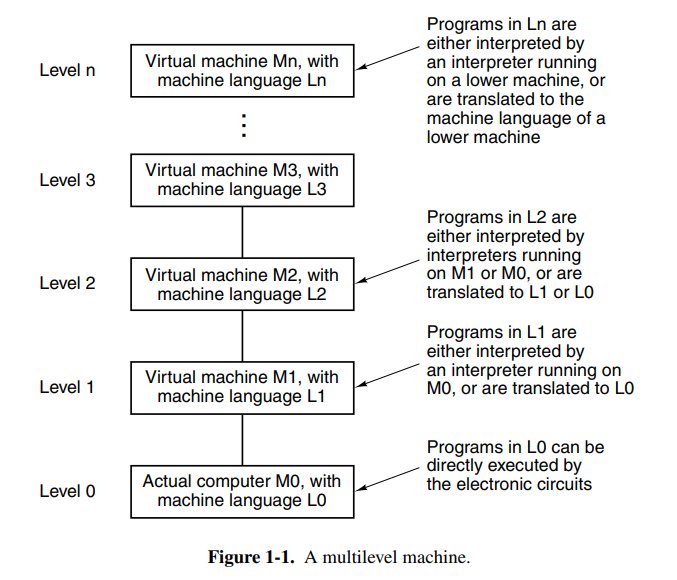
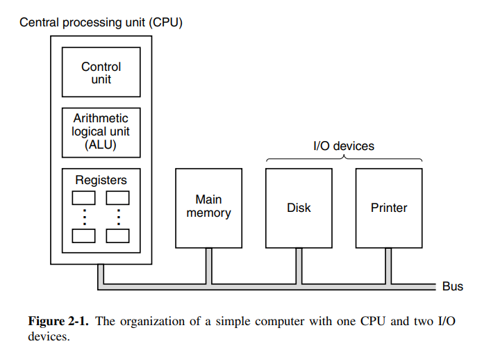
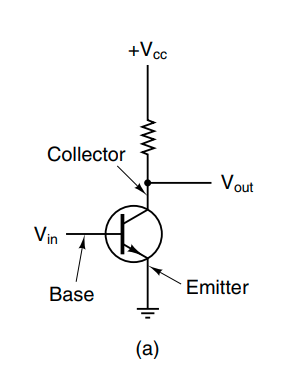
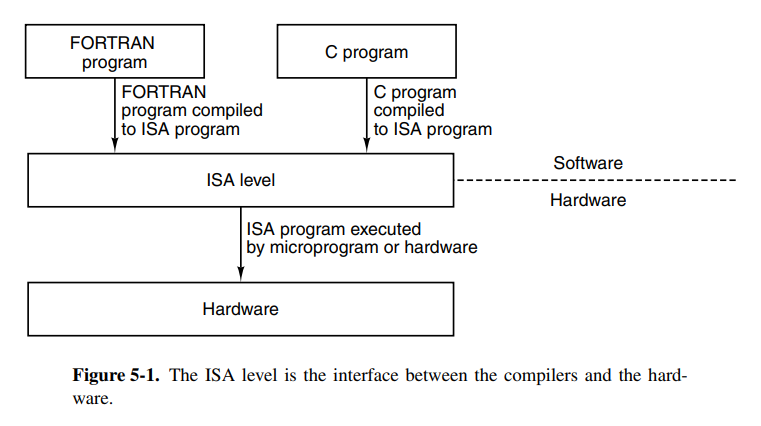
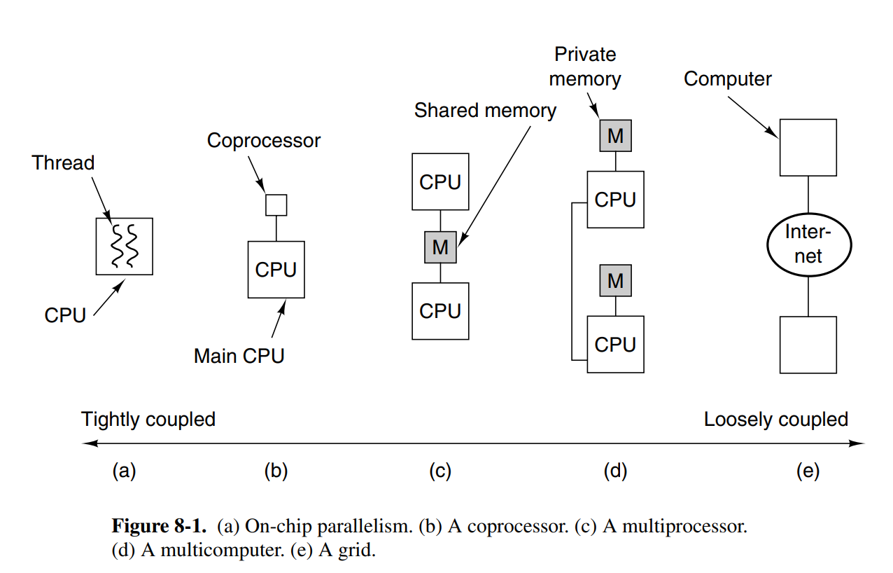

# TDT4160: Datamaskiner og digitalteknikk

Tatt høsten 2022. Nedenfor er notater for alle kapitler i boka som var i pensum.

## 01. Introduction

Chapters: `1.1.{1, 2, 3}`, `1.5`

### 1.1 Structured Computer Organization

There is a huge gap between what people wish to do and what computers can do. Computers can really only do small tasks, but we can arrange and build more complex tasks out of these. The result is programming languages that undergo many stages of translation until we have instructions for a central processing unit.

At the top of the stack, we have comfortable programming languages like C, while at the bottom of the stack we have transistors and microelectronics. Thus we have a stack of languages or runtimes that each call down or interpret some instructions at its own level. A stack for a programming language like Python might look like this where we unwrap down until some baseline, like the Python virtual machine written in C.

For a lower language like C or C++ we instead have a more native stack that is closer to the hardware our software is running on.

A brief explanation of the different levels in this stack can be explained like this:

- Level 5: a high-level programming language is easy to work in and manipulate like C or C++. The code here is translated to an assembly language ISA.
- Level 4: some lower level representation of the level 5 program. An example of this is Java bytecode.
- Level 3: similar to the level below, this level more closely represents what is available on the system the software is running on, allowing for lower level manipulation of the operating system and connected devices. Maybe like an executable program that can be executed on an operating system.
- Level 2: a format that represents the actual semantics of the hardware more closely without typical control flow constructs. Instead, we use jumps and registers to move values. Key terms here are assembly language and instruction architectures such as x86, etc.
- Level 1: the ISA represents microinstructions that are executed on a microarchitecture. Key terms here are registers and buses that data travel along as well as execution on an ALU.
- Level 0: the physical digital logic that is executed over a set of billions of transistors in a real computer with logical gates.

In the past when the computer was invented we didn’t have operating systems, and everything was a nest of digital circuits. It was at this time (1940s) that we came up with the idea that ISAs were going to be executed on a level below, allowing for more complex ISAs while keeping the underlying logic relatively simple.

The operating systems arrived later and provided access to operating system macros or supervisor calls which today are known as syscalls. It made it easier to interact with the system because previously developers would just have to dump the memory and try to debug it.

After this time, the competition for better and better instruction sets started and programmers developed more optimized instructions such as `INC` which would outperform `ADD 1`. We also got more mathematical operations, floating-point arithmetic, procedures and jumps as well as instructions for handling character strings. Sometime later they found out that reducing the instruction set and having some instructions directly executed on the hardware could speed up machines and we had finally come full circle.

### 1.5 Metric Units

The books just wants to clarify that it uses metric units with the following table attached.

---

## 02. Computer Systems Organization

Chapters: `2.1{1-6}`, `2.2.{1,2,3,5}`, `2.3.{1,2}`, `2.4.1`

### 2.1 Processors

The brain of a computer is the central processing unit (CPU). It consists of a couple of components, most notably the arithmetic logical unit (ALU). Additionally, it has CPU registers to move data quickly without needing an external memory store like a disk. Two notable registers are the program counter (PC) which is the index into the program to be executed next, and the instruction register (IR) which holds the instruction currently being executed. Most computers have other special registers, while almost all have general-purpose registers.

The ALU performs addition, subtraction, and other simple operations on its inputs, yielding a result in the output register. This output register can be stored back into the register and later stored in memory if desired. Most instructions are able to be categorized as either register-memory or register-register. Register-memory instructions allow memory to be loaded into registers and used, whereas register-register instructions typically fetch operands from registers and store the result of an ALU operating back into a register.

The process of running two operands from registers through the ALU and storing the result is called a data path cycle and is the bread and butter of a typical CPU. Modern CPUs typically have multiple ALUs that can run in parallel because the faster the data path cycle is, the faster the machine runs.

Instruction execution is a repetitive step that is done for each instruction in a program. The flow goes something like this:

1. Fetch the next instruction to be executed (from PC)
2. Increment PC to point at the next instruction
3. Determine the instruction type
4. If it uses a memory word, find out where to fetch it from
5. Fetch the word, and if necessary, move it into a CPU register.
6. Execute the instruction
7. Go back to the first step and repeat.

This cycle is known as the fetch-decode-execute cycle.

Today we have two main types of instruction architectures, RISC and CISC. RISC takes a trade-off by having instructions take fewer cycles but having more instructions. CISC does the opposite and optimizes for a small instruction set that may use more cycles per instruction. Cycles as in clock cycles.

Today with the history of chip development, certain design principles have been accepted as good practices. Developers should look out for technological changes that might affect the balance between the components in the machine. You should also try to keep the chips backward compatible with older versions of the ISA. Here are some other common guidelines for RISC instruction sets:

- Instructions are executed directly on hardware: try to avoid microinstructions at all costs. CISC will likely use microinstructions since instructions can take many paths.
- Maximize instruction issue rate: try to achieve as high millions-of-instructions-per-second (MIPS). This can be done by not necessarily running instructions in order if the instructions interact with different registers. Getting this right requires a lot of bookkeeping but it has a huge performance potential.
- Instructions should be easy to decode: should make instructions fixed-length with a small number of fields or parameters.
- Only loads and stores should reference memory: to keep operations simple and into separate steps, it is very convenient that only loads and stores access memory. This allows the optimizer to assume nothing else touches memory which is a huge benefit.
- Provide plenty of registers: memory is slow, registers are fast. The ISA should provide a lot of registers (at least 32) to allow words to be fetched, allowing them to stay in a register until it’s no longer needed.

Another achievable performance boost can is parallelism at the instruction level. If your architecture can execute multiple instructions in parallel it will greatly increase the MIPS. A nice way to do this is with pipelining where you’ll begin fetching and preparing the execution of the next instruction while the current one executes.

This can be optimized further by using dual pipelines with multiple ALUs to speed up execution greatly. It’s also possible to split instructions into pipelines based on the instruction type (e.g: only run basic arithmetic instructions on one pipeline). This is called superscalar architecture. Today the term is mostly used for CPUs that execute multiple instructions in a single CPU cycle, often 4 or 6.

Pipelining and superscalar architecture will only speed up in factors of 5 or 10. To achieve higher gains we should use multiple cores. A lot of engineering happens in loops or arrays which is why single-instruction-multiple-data (SIMD) processors or vector processors were invented. They are excellent at executing operations of an array or a vector of values. If we have a 32 SIMD stream multiprocessor the architecture may look a little like this:

This architecture can execute up to 512 instructions per cycle which are impressive considering a general-purpose quad-core CPU would struggle to achieve 1/32 of that. Vector processors have the concept of vector registers which allows feeding vectors into the ALU and other processing units.

Next, we have the idea of using multiple CPUs in a single computer. This is the multiprocessor, a system with more than one CPU. This is tricky because the CPUs have to coordinate reads and writes of memory.

Finally, we have the multicomputer. Computers that are composed of multiple computers. Here the CPUs are loosely coupled unlike the multiprocessor because it’s essentially a group of systems working together.

### 2.2 Primary Memory

Computers need storage. Without storage there would be no way to persist data in a computer and you could in fact, not even store the program to be executed.

The primitive unit of memory is a single bit. This is a value that is either 1 or 0, analogous to an electrical signal being on or off. Combining four bits gives you a nibble, eight bits give you a byte. Today most computers are 64 bits, meaning their instructions (and consequently their registers) can operate on 64 bits operands. Bytes are grouped into words based on the computer. On a lot of computers, a word signifies 4 bytes and an octet signifies 8 bytes.

Memory consists of cells or locations, each of which can store a set of bits. Each cell has a number called its address by which programs can refer to it. Each cell in memory consists of the same number of bits.

The bytes in a word can be numbered from left to right or right-to-left which is important for how instructions work on the words. On big-endian systems, the leftmost is the least significant in the word. The lack of standard byte ordering can cause problems when moving programs from one machine to another.

Historically, CPUs have always been faster than memory. This means that memory can be the bottleneck in the execution of a load/store-intensive program. To combat this we have CPU caches, a memory that performs at extreme speeds compared to regular memory, but as a consequence, it’s very limited in size.

Caches are broken up into cache lines which refer to a block of memory. Whenever memory is loaded from the main memory, you load the entire line instead of a single word. If you have a 64-bit line size, loading address 260 will load the entire line of 256-319 into the cache. Often programs access memory that is near previously accessed memory which means this will perform better than loading words on demand. A cache miss is when you tried to load memory from cache that wasn’t in the cache.

### 2.3 Secondary Memory

We often want to store a lot of data on a computer so we need secondary memory as well. Memory can often be categorized into a pyramid, where the width represents how slow access is.

Today, magnetic and solid state disks are the most common secondary storage types in use. Magnetic disks consist of a number of aluminum platters with magnetizable coating. When the electrical signal passes through the head, it magnetizes the surface, aligning the magnetic particles. The problem with magnetic disks is that they can change state if they are thrown around physically. The rotation speed of the disk affects the performance, with most rotating at 5400 RPM.

Each disk may also have different zones, each with many tracks to make as much use of the space as possible.

### 2.4 Input / Output

Input and output are the core of interactive computers and is also what allows us to do things with computers such as printing a document.

Most computers have a structure similar to this (see picture below) on the motherboard. It allows other components in the computer to connect and communicate with the motherboard, and in turn, the data flow.

Each I/O device consists of a controller and the device itself. The controller is usually connected to the motherboard or sometimes contained on the motherboard itself. The job of the controller is to control its device and handle bus access for it. When programs wish to write to the device, it commands the controller which issues the appropriate commands. Controllers that perform memory write without CPU intervention are said to perform direct memory access (DMA).

In the case where both CPU and I/O controller want to write to a single bus at the same time, the controller is usually prioritized since it cannot hold onto data.

Today most devices use peripheral-component-interconnect (PCI) buses. The design was led by intel, but they decided to make it open to encourage the entire industry to adopt it.

The PCI bus was later replaced by PCIe (e for express) which performs faster and bits are transferred in parallel. In fact, it’s not a bus, but instead a network of lines and packet switching, more like the internet.

---

## 03. The Digital Logic Level

Chapters: `3.1.*`, `3.2.*`, `3.3.*`, `3.4.*`, `3.7.*`, `3.8`

### 3.1 Gates and boolean algebra

Digital logic consists of electrical voltages in a piece of metal where voltages in the range 0 to 0.5V indicate the boolean value 0, while ranges 1 to 1.5V indicate the boolean value 1. In modern computers, the electrical flows are controlled by transistors. A transistor consists of a base, a collector, and an emitter. When there is enough voltage in the base, the voltage from the collector will flow into the emitter, acting like a switch.

We can connect these switches together to create more complex logical flows. These are called logical gates and control whether the input ports should propagate to the output or not. Here are a few common ones.

Logic like this is termed boolean algebra. We often describe the logic using truth tables as indicated above. Boolean algebra uses named variables, where $A$ indicates the base value, while $\overline{B}$ indicates the opposite.

When implementing boolean algebraic operators with digital logic we can use the following set of steps from the book after determining the truth table for our operations.

When building complex operations we obviously want to reduce the amount of gates used. By analyzing parts of our circuit we can often reduce gates used in common patterns. The following circuits are the same, yet one uses less gates than the other.

Additionally, here are some rules that can be useful when working with boolean algebra:

### 3.2 Basic digital logic circuits

Gates are not individually manufactured or sold invididually, they are sold in integrated circuits that have a certain use which the purchaser will connect and wire up themselves.

A combinational circuit is a circuit that can take multiple inputs and return multiple output values. Examples of this kind of circuit are memory elements that may generate outputs dependent on the stored values as well as the input variables. Circuits that implement a truth table are often combinational circuits.

A multiplexer is a circuit with $2^n$ inputs as well as $n$ inputs to control which input to select, having only one output. This is very similar to the memory line selector circuit that has been shown in the curriculum. Here is a 8-input multiplexer. The opposite of a multiplexer is a demultiplexer, which can take one input and select one of the $2^n$ outputs based on the selection inputs.

Decoders are circuits that take an $n$-bit number as an input and use it to select exactly one of $2^n$ output lines. Decoders can be useful as an entry point into memory circuits that consist of multiple chips. You could say that depending on the input bit number (which would be the address) you select one of the $k$ chips on the circuit.

Another useful circuit is the comparator which compares two input words and produces a $1$ if they’re equal and $0$ if they’re not equal. It’s a really simple circuit consisting of $n$ inputs the size of the words to be compared and a single OR gate.

Additionally, we have arithmetic circuits such as shifters that shift bits or adders that sum numbers. Below is a single-bit left/right shift circuit and an adder with carry. The adder is chainable, meaning you can connect as many of them as you want and you’ll be able to sum $n$ bit numbers,

The arithmetic logic unit (ALU) is a component found close to all CPUs that is responsible for computing AND, OR, NOT, and SUM of two words. The ALU may have more operations. It has function-select input lines which determine which of the operations should be performed on the incoming two words.

This ALU has a decoder at the bottom-left to determine which of the functions to perform. It also has options to invert $A$ as well as force either $A$ or $B$ to be 0 by toggling $ENA$ or $ENB$.

In most digital circuits the order of operations or events is critical. To allow circuit designers to achieve optimal timing relations, many digital circuits use clocks to synchronize signals. A clock is a circuit that emits a series of pulses with precise pulse widths and the precise interval between pulses. Today, most new processors have a clock frequency of upwards of 4GHz. Designers can use the rising or falling edges to synchronize signals.

### 3.3 Memory

Latches are circuits that hold onto their old state by feeding themselves into a loop. Below is a simple SR-latch. See SeqLogic for details.

To prevent the latch from changing state except at certain times it’s often connected to the clock, and thus we have the clocked SR-latch. It ensures that S and R won’t be able to enable if the clock is not on a rising tide.

To solve the instability with the SR latch (see SeqLogic for details) you have the clocked D-latch. It’s a circuit with “true memory” with the stored value always available at $Q$. To load the current value $D$ into memory, a positive pulse is put on the clock line. This circuit uses 11 transistors. More sophisticated, but less obvious circuits use 6 transistors and are typically the ones in use in practice. The nice thing about a D-latch is that it can remain stable as long as it’s connected to power.

In many circuits, it’s necessary to sample the value of a certain line at a particular instant in time and store it. A more suitable variant than the latch is the flip flop which will only synchronize state at a rising or falling edge. See SeqLogic for details on the flip-flop.

Flip flops can be combined in groups to create registers, a type of storage that holds data types larger than a single bit.

More conventional memory can be organized by putting together a lot of the components that have been discussed so far. The circuit below holds four 3-bit words with a few inputs determining operations to perform on the memory as well as a few select lines.

The above circuit also ensures that it is possible to read and write to the memory at the same time. The $CS$ input is named chip-select and determines if the memory should do anything at all. If $CS$ is low, nothing will change.

If desired, one could expand this chip to larger memory sizes with relatively small growth in inputs. Following Moore’s Law (or maybe not anymore lol) you can assume the transistor count that can fit on a chip, and thus memory size to double every 18 months, but that does not render old chips obsolete as there are trade-offs in speed, size, cost, and other factors.

Random access memory (RAM) typically categorizes memory that is volatile, meaning its state will not be kept when the power goes out. RAM is typically implemented using circuits similar to the D flip-flop (but likely the 6-transistor alternative).

There are two kinds of RAM, static and dynamic. Static RAM can hold onto its contents as long as the power is kept on, while dynamic RAM is extremely fast, but is not implemented using D flip-flops. It’s usually used for cache because it’s so fast. Dynamic RAM is typically constructed using a transistor and a capacitor with the capacity charge determining the state. Because the charge tends to leak out, the RAM must be refreshed every few milliseconds to prevent the data from leaking away.

On the other side, we have non-volatile memory chips, typically ROMs (read-only memory). The data can persist even with the power being off. The problem is that the data cannot change after being manufactured. Thus PROM was invented which is programmed (changed) _once_ after manufacturing. That had its problems because you couldn’t change the data. EPROM is PROM that can erase its own data after being exposed to strong UV light for 15 minutes. Finally, we have EEPROM which can be erased with an electrical charge. Finally, we have flash memory which is very flexible and typically used in cameras and other small digital devices.

### 3.4 CPU chips and buses

All modern CPUs are contained on a single physical chip, and each CPU chip has a set of pins (of different types) that are used to communicate with the outside world. These types are broken down into:

1. Address: pins used to address which memory address to access
2. Data: data input or output lines
3. Control: pins used to communicate with the other devices

Take an example: to fetch an instruction, the CPU puts the PC address onto the address pins, and informs the memory using the control pins. The memory then writes back to the data pins, and asserts with a signal on the control pin. The CPU can now perform its instruction. The instruction might require reading or writing memory, in which case this process is repeated.

Two key parameters that determine the performance of the CPU are the number of address pins and data pins. CPUs with $n$ address pins can only address $2^n$ bytes of address space, and CPUs with $m$ data pins can only read or write an $m$ bit word at once. Common values are 8 (for data), 16 (for address), 32, or 64. A CPU with four 8 data pins will take 4x the time to read a 32-bit word compared to one with 32 data pins.

Control pins are used to regulate and time data flow among other tasks. They are grouped into:

- Bus control: pins used to communicate to memory and I/O chips telling whether the CPU wants to read/write or do something else with the devices.
- Interrupts: usually inputs into the CPU from other devices. The CPU can initiate a device read, continue with some other work, and wait for an interrupt from said device once the read was complete.
- Bus arbitration: used to regulate the bus, see bus arbitration section
- Coprocessor signaling: if the chip has multiple processors, these can be used to synchronize between them.
- Other pins: pins vary between processors, some are used to accept or provide status information, and others are used for debugging or resetting the computer, or for backward compatibility with older chips.

A computer bus is a common electrical pathway shared between multiple devices. It allows devices to communicate and share data. They are grouped into different categories based on their function.

Some are used internally in devices, for example, to send data from the CPU to the ALU, or between devices to transport data from or to memory.

In the past, computers only had a single external system bus, consisting of 50-100 parallel copper wires etched onto the board. Modern computers generally have a special-purpose bus between the CPU and memory, and other buses for the I/O devices.

A critical part when designing a bus is to make it possible for third parties to be able to interact and connect to the bus. Thus the bus protocol used is important. If your bus is an internal one, this obviously does not apply. Some common protocols are Unibus, Multibus, ISA, PCI, or USB. As previously mentioned, PCI-Express is often called a bus, but it is not actually a bus.

The devices on a bus are either active or passive. Active devices are called masters, because they initiate an operation, while the passive ones are called slaves. Multiple combinations of bus master-slave relations exist, but memory is never a master.

The signals that are sent out are frequently too weak to power the bus, especially if the bus is long, or has many devices connected to it. For this reason, most masters are connected to a bus driver, which is essentially an amplifier. Slaves are connected to a bus receiver, and devices that can be both master and slave are connected by a bus transceiver. The bus interfaces are often tri-state, meaning they can float (disconnect) when they are not needed or are connected in an open-collector configuration. Open-collector performs a wired-OR when multiple devices assert the line at the same time.

The bus also has addresses, data, and control lines. These need not work exactly like the CPU ones. Typical buses may have one line for memory reading, one for memory writing, another for I/O reading, I/O writing, or some other operation. A decoder is then needed to match the CPU lines to the other lines. This is a quite complex subject that is not discovered in depth here.

Bus width is the most obvious design parameter on buses. The more address lines a bus has, the more memory the CPU can address directly. The problem boils down to physical space because decreasing the clock cycle on the bus is difficult because signals may skew (known as a bus skew), and it will likely break compatibility with older models. Thus the primary option is to scale in bus width. Another option is multiplexed buses, which can perform multiple roles on the same line, but this also brings another overhead, meaning designers have to weigh all these options against each other.

There are two ways buses are clocked, synchronous and asynchronous. Synchronous buses sync each operation the bus may have against a clock, making it easy to communicate across components. This does, however, mean that actions have to insert wait states until external operations such as memory reads have finished. The other option, asynchronous clocks are easy to work with due to discrete time intervals, but everything works in multiples of the bus clock. This means it may be tricky to use newer technology on an older bus, because there may be a case where no performance gain is earned because the new component’s increase is still limited by the minimal time for the design. Asynchronous buses also interlock signals using a full handshake, which can bring more overhead.

Bus arbitration is necessary when multiple devices want to become bus masters at once. Daisy chaining is one solution to this problem, making the device that is physically closest to the arbiter gets priority. Some daisy-chaining arbiters use different priority levels. This allows more fine-grained control over the priority of devices, as more important devices are connected to the higher-up levels. Some arbiters have a third line that asserts when it has accepted a grant and seized the bus. This means while the operation is happening, the other devices can already decide which one is to go next. The CPU is often given low priority because it can wait. Another strategy is to only use three lines, one bus request line, one busy line for the current master’s transfer, and finally a daisy chain to give priority. This means there is no arbiter, so it’s cheaper, faster, and not subject to arbiter failure.

Bus operations can typically be done quicker in block transfers. When initiating a block transfer, the master informs the slave how many words are to be transferred.

Another important kind of bus cycle is for handling interrupts. When the CPU commands an I/O device to do something it usually expects an interrupt when the work is done, requiring an interrupt to be asserted.

### 3.7 Interfacing

Interfacing describes external devices such as monitors, keyboards, or printers. These want to connect to a bus, typically a Parallel I/O (PIO interface). It essentially allows the CPU to write data to any of the I/O lines, allowing the devices to react. It’s also possible to build more complex PIO interfaces. One popular operating mode provides for handshaking with external devices, such that an output device that is not always ready to accept data can communicate with the source.

---

# 04. The Microarchitecture Level

Chapters: `4.1{1,2,3}`, `4.3.*`, `4.4.{1,2,3,4,5}`, `4.5.{1,2}`

TODO: Maybe go more depth into each instruction

---

### 4.1 An example microarchitecture

The book introduces the microarchitecture level with an example microarchitecture that is a subset of the JVM, using only integer instructions and values. The architecture is called IJVM. Because the JVM has some complex instructions such as `invokevirtual`, it’s best to solve this at a microprogramming level.

Considering we’re working on an architecture as described in chapter 3, we can imagine our problem as a code-lowering problem from IJVM instructions into the microcode for our microarchitecture.

The data path of the IJVM microarchitecture is an extremely basic and primitive data path that moves each cycle through the ALU. Values can be read from the registers, put onto the B bus, then passed through the ALU (optionally without doing anything to the value), and stored back into registers from the C bus.

Each of the registers on the board has a different purpose. The microprogram registers are:

- MPC: Stores the address (in the control store) of the next microinstruction
- MIR: Stores the current microinstruction whose bits drive the control lines of the CPU.
- N: Copy of the sign bit (higher-order bit since we only have integers) of the result from the ALU. Used to determine where to jump in conditional branches.
- Z: Whether the generated value from the ALU is equal to zero. If it’s equal to zero, its value is 1. Used to determine where to jump in conditional branches.

The data path registers have the following roles:

- MAR: Write-only register of the 32-bit word that is being written to in memory.
- MDR: Holds the address of where MAR points to.
- PC: Program counter into the next byte in the instruction stream. For instructions with parameters, it will point to the next parameter.
- MBR: Stores a single byte read from the memory cell addressed by the PC. Sometimes referred to MBRU which reads the byte data as an unsigned byte. Default is read as a signed number.
- SP: Stack pointer
- LV: Pointing to the local variable table of the currently executing method
- CPP: Pointing to the constant pool.
- TOS: Copy of the value at the top of the stack.
- OPC: Stores old PC, and is also used as a scratchpad register.
- H: Holds the value to be supplied on the left side of the ALU. Is replaced by A bus later.

Within the current design, there is no A-bus to be fed into the ALU. This means that every operand in a binary operation has to take an extra CPU cycle to be passed into the hold (H) register. This is a problem that will be resolved in later sections.

Additionally, two more control lines can be used to control the output from the ALU in the shifter. The control line SLL8 (Shift Left Logical) shifts the contents left by one byte, filling the 8 LSB with 0. SRA1 (Shift Right Arithmetic) will shift the contents by right by one bit, leaving the MSB unchanged.

The architecture also specifies that it is possible to both read and write the same register in one cycle. This is because reads and writes are performed at different times in the cycle. It is thus possible to write SP to the B-bus, perform some ALU operation on it, and write the result back to SP once done.

The timing of the data path occurs with the following steps:

1. On the falling edge of the clock pulse, bits that drive the gates are set up, taking $\Delta w$ time.
2. Moving the necessary register onto the B bus, and waiting for it to become stable takes another $\Delta x$ time.
3. Performing the calculation on the ALU and through the shifter takes additional $\Delta y$ time.
4. After $\Delta z$ time, the data has propagated onto the C bus to the register, where they can be loaded on the rising edge of the next pulse.

Memory operations in the architecture are done with two memory ports.

- 32-bit addressable port controlled by MAR/MDR.
- 8-bit byte addressable port controlled by PC. Readonly.

MAR contains word addresses so that the values in the register refer to consecutive words. PC contains byte addresses, so its values refer to consecutive bytes. The reason for this distinction is that the PC memory is used to read from the instruction stream, whereas the MAR/MDR-controlled port is used for general-purpose memory.

The instruction format occupies 32-bit signals, with the groups described as:

- Addr: contains the address of a potential next microinstruction
- JAM: determines how the next instruction is selected, branching information.
- ALU: ALU and Shifter functions
- C: selects which registers are written from the C bus
- Mem: memory functions, whether to fetch the next PC, write or read memory.
- B: selects the B bus, encoded as shown.

The control signals to be enabled for each cycle is determined by a sequencer. It’s responsible for stepping through the sequence of operations for the execution of a single ISA instruction. It must produce the state of each control signal in the system, and the address of the instruction to be executed next.

The controller manages memory called the control store, which holds the complete microprogram. This is the ROM memory which actually describes how the CPU controller should interpret the different instructions. The MPC register is the microprogram counter, similar to PC for the regular instructions, and the MIR register holds the current microinstructions, whose bits are used to control the signals that operate the data path.

This piece of the system essentially describes how each of the instructions should be executed, and which CPU control signals should be enabled for any instruction.

The next instruction is determined by the JAM fields in the microinstruction.

- If the JAM field is 000, the next address will simply be copied into MPC, and the next instruction can start.
- If JAMN is set, the 1-bit N flip-flop is ORed into the higher-order bit of MPC.
- If JAMZ is set, the 1-bit Z flip-flop is ORed into the higher-order bit of MPC.
- If both are set, both are ORed into the higher-order bit.

The reason the N and Z flip-flop registers are needed is because at the stage this potential OR-ing happens, the B bus is no longer being driven, so the ALU outputs can no longer be assumed to be correct. This way, we can ensure the MPC calculation is correct.

- If JAMC is set, the 8 MBR bits are bitwise ORed with the 8 lower-order bits of NEXT_ADDRESS. of the current microinstruction. This allows for efficient multiway branching by letting MBR determine where to jump. This means be can jump max $2^8$ offsets from the previous instructions, giving us a limit of how local the jumps are.

### 4.3 An example implementation

The book introduces a syntax notation for the microinstructions. This is a rough overview.

- `SP = SP + 1; rd` Read SP, increment it by one, and store back into SP
- `MDR = SP` Copy SP into MDR
- `MDR = H + SP` Perform some ALU operation and store into MDR.
- `SP = MDR = SP + 1` Store SP + 1 into both SP and MDR
- `goto Label` Perform a jump to the given label
- `Z = TOS; if (Z) goto L1; else goto L2` Set the JAMZ bit
- `goto (MBR or X)` Set the JAMC bit, `or X` clause is optional, 0 if not provided

Using this notation, we can implement all the instructions.

The book has in-depth descriptions of how each instruction works, but given the notation and simplicity of the Mic-1 architecture, most instructions should be rather obvious.

### 4.4 Design of the microarchitecture level

While the Mic-1 architecture works and can serve its purpose, there are still a lot of ways to improve the efficiency of the code and architecture. This section goes into depth into a few different ways to optimize the architecture. The three basic approaches for increasing speed of execution are as follows:

1. Reduce the number of clock cycles for an instruction (reduce path length)
2. Simplify organization so clock cycles can be shorter (reduce path length)
3. Overlap the execution of instructions, i.e pipelining

Execution speed is almost always a trade-off over cost. Cost can be many things such as memory, system complexity, or other resources. Most components have some alternative with great speeds, but they might require more real-estate (physical space on the board) or some other trade-off. It is up to the designer to find out which operations that should be prioritized, and which trade-offs are the best.

One of the most time-consuming phases of the Mic-1 is fetching the next instruction, and updating the PC. If we could offload this work to something else, or do it while we’re waiting for some other operation to complete that would be optimal. An excellent example in the Mic-1 architecture is the POP instruction which has to wait for the new TOS to be read from memory, leaving an empty CPU cycle. In this empty CPU cycle, we can increase the PC because the dead cycle doesn’t use the ALU. This way we just saved one cycle!

Another problem with our architecture is that for each binary operation, we need an extra CPU cycle to move data to the hold register. If we replace the H register with another input bus A, with the same capabilities as bus B, we can save cycles!

An even more radical approach would be to offload the increment of the PC to another unit on the CPU. This introduces the instruction fetching unit (IFU) to the Mic-1 architecture. This is a separate component that will run in parallel with the other parts of the CPU, allowing it to increment the PC through its own ALU without having to take a cycle from the main ALU.

We can also use the IFU to make available the next 8- and 16-bit pieces, meaning the main unit doesn’t have to spend extra cycles doing this. We add an additional MBR1 and MBR2 which track the most recent 8- and 16-bit values to be consumed by the main execution unit. When the MBR1 is read, it pre-fetches the next byte and loads it into MBR1 immediately. The former is sign-extended to 32 bits, while the MBR2 provides the same functionality for the next two bytes. It also has the same two interfaces to the B bus, MBR2, and MBR2U.

The IFU can greatly reduce the path length of the average instruction because it eliminates the main loop entirely since we pre-increment PC while the main execution unit runs. The design with the previously mentioned changes is now named Mic-2.

This is the new microprogram for Mic-2. It is clear that a lot of cycles have been cut with the optimizations we have done.

The next principle to introduce to our Mic-2 architecture is a pipelined design. This means that we’ll be pipelining the instructions to greatly increase speed. The main components of the current data-path cycle are as follows:

1. Drive selected registers onto A and B buses
2. Perform work with ALU and Shifter
3. Write results back to registers and memory

We now introduce a new register onto each bus (latches). This effectively partitions the data path into distinct parts that can now operate independently of each other, making it possible to pipeline the design. This means we can theoretically split the data path into three (close, but not realistically) equally long time intervals, each around 1/3 of the original one.

This means we can begin pipelining the first phase of the next instruction when the first phase for the current instruction is over. Theoretically, this would give us a 3x speed increase. Take the microcode for the SWAP instruction:

This can now be broken down into three distinct phases. Once swap 1/2 is finished, we can begin processing the next instruction. In some cases we cannot begin the next cycle right away, maybe we are waiting for a memory read. This means the next micro-step cannot start and the produced dependency is called a true dependence. This is solved by inserting a stall until the memory we want to write is complete.

The Mic-3 architecture is now going to receive a full 7-stage pipeline. The problem with the pipelining in Mic-3 is that we have no great way of handling jumps after instructions, because we cannot determine which instruction is going to be next before the entire calculation of the current instruction is completed. The seven stages of the pipeline are:

1. Instruction fetch unit: the IFU as previously outlined. This now feeds into a new component, the decoding unit.
2. Decoding unit: this unit receives the instruction from the IFU, and uses an internal table to determine the length of the instruction (does it have any arguments). It can then index into the micro-operation ROM which knows what bytes are opcodes, and which are operands. It ships the new index into the queuing unit. It’ll also determine if the current instruction is a final one (iadd3) and if it does a multibranch with Final and Goto flags.
3. Queuing unit: it’ll take the instruction index, and continues queuing microinstructions until a Final flag is reached. If it has more space in the queue, it’ll keep asking for the next one. We then send these instructions to the MIR. We also have to duplicate the MIR registers, because the fields on each micro-operation are not active at the same time. Here we introduced four different MIRs. At each clock cycle, MIR3 is copied to MIR4, MIR2 to MIR3, and MIR1 to MIR2. MIR1 is then loaded with a fresh operation from the queue.
4. The buses to the ALU work the same as previously. The operands for the current micro-operation in MIR4 are fetched.
5. The ALU also works the same as previously. The code is executed through the ALU and Shifter as usual.
6. The results are written back into their registers as usual.
7. If required, results are also written back to memory as usual.

One problem to address here is microbranching. When a microbranch occurs, the pipeline cannot continue, otherwise, we might execute code that was not supposed be executed, and thus we have a faulty interpreter. This is where the Goto flag comes in handy, as we can pause the entire pipeline based on the flag. This means we will determine where the microbranch jumps to, and we can continue our pipeline from there. There are a lot of questions around this, what about instructions that have already been fed into the queue? The book doesn’t cover this because it’s a huge mess beyond the scope of the book.

### 4.5 Improving performance

This section focuses on several improvements that can be done to the system which can greatly increase performance. It does, however, happen to be the case that these are difficult improvements to get right, and that’s beyond the scope of the book to cover.

It has always been a problem to keep memory speeds up to the same speed as the CPU clock. Thus we use smaller, but extremely fast caches to cache data from the main memory. Most modern computers have three layers of cache, varying in speed and size from the main memory to the CPU. These are often called L1, L2, and L3. It is important to hit the “cache line” when accessing memory, so multiple different strategies exist to map the data.

- Direct mapped cache: is cache having each entry in the cache hold exactly one line from main memory. Each line holds a validity flag, a tag field mapping to the line of memory from which data came, and a copy of the data. When the CPU requests the data, we’ll either hit or miss the cache. If we hit it, we save huge amounts of time, but when we miss, the cache is more expensive than just fetching from memory.
- Set-associative caches: if we happen to have data that are close to each other, yet span more than a single cache line, the direct mapped cache will have problems since we’ll miss a lot. An N-set-associative cache can hold $n$ lines in each cache entry. While they are more complex and expensive, they pay off because you can hold a lot of closely packed data together. A common strategy for each line in the entry is to invalidate based on usage using an LRU cache.

When the CPU writes to a word that is in the cache, you have two options. Do you want to write back to main memory right away, or do you want to defer writing? Both options are valid. Immediately writing back is called a “write-through”, the deferred method is called a “write-deferred” or a “write-back”. The concern about deferring the write is in cases an error occurs and memory has to be restored, how do you solve this? Another common question is how to write back memory locations that are currently not cached. This is why caching and cache invalidations are some of the hardest problems in computer science.

Another strategy that can be used to optimize is to perform branch prediction. We have two kinds of branch prediction, static and dynamic. Because modern processors are heavily pipelined we will come across the branching problem a lot, especially since programs typically have a lot of branches.

- Dynamic branch prediction: maybe something runs a lot in a loop, then we can predict that the next iteration will also follow the same path, allowing us to create a “hot path”. An issue occurs however when something like an error occurs. This means we’ll hit a cold path, and we’ve just done a bunch of pipelining work for nothing. At this point, we need to be able to recover and go back. Backtracking requires industrial-strength bookkeeping, but is usually done by tracking pipeline state in a scratch register.

  

- Static branch prediction: if we very well know that something is likely going to branch to the same spot, maybe by analyzing code such as `for (int i = 0; i < 100000; i++)` the compiler can perform some form of branch prediction. Some hardware has special branching constructions that take branch prediction into count, and a compiler could make use of this. Another static approach is performing profiling on the program once, and re-compile feeding the compiler the profiling metadata.

In either case, branch prediction is a complex topic whose details are out of the scope of this book.

---

## 05. The Instruction Set

Chapters: `5.1.{1,2,3}`, `5.3.{1,2}`, `5.4.{1,2,3,4,5,6,7,8,9}`, `5.5.{1,2,3,4,5,6,7}`, `5.6.{1,2}`

### 5.1 Overview of the ISA level

This chapter dives into more technical details about design choices when designing an instruction set. The ISA level has special importance in the design of computers because it’s where the hardware and software (through compiler engineers) meet. There is also pressure to keep the ISA backward compatible for the future when newer chips will be produced. Apart from this, the designers are pretty free to do whatever they want.

There are two primary factors that rule out what separates a good and a bad ISA.

- The instruction set should be possible to be efficiently implemented with both current, and future technologies, making the ISA future-proof. Poor designs can make the code slower because the chip designer will have to cope with the design issues. Examples of bad ISAs are ones that only lasted for one generation of cost-effective implementations.
- It should be easy to write compilers for the target. It should be relatively easy to make decisions among limited alternatives. A good ISA provides an easy-to-implement interface between the hardware and the software.

The ISA defines how the machine appears to a machine-language programmer. The ISA defines which instructions are available, what the memory model looks like, what registers exist, what data types exist, and so on. While this definition doesn’t say anything about whether the microarchitecture is superscalar, microprogrammer, or any other features it may have, it’s often considered convenient to note something about these properties too.

If a compiler engineer has to simply assume the architecture isn’t pipelined, they’re not able to squeeze in all the optimizations they might have wanted for a pipelined processor. In some cases, the ISA is defined in a specification document, such as the ARMv7 ISA, and other times they’re proprietary, such as Intel’s x86 architecture before they suspiciously released it.

The memory model of the ISA defines how memory access works. All computers divide memory into cells that have consecutive addresses where the most common cell size is 8 bits, but sizes between 1-60 have been used in the past. Reading memory typically requires a multiplicative of 8 to read or write to memory. This means that if you want to write bits 5, to 9, you have to read/write the entire 1-8 and 2-16 blocks of memory. This was the case for 8088-compatible ISAs. Most modern ISAs don’t allow arbitrarily writes. One should also be careful of reordering operations that affect memory, some ISAs are designed as load-stores which means only loads and stores commit changes to memory which relieves this problem.

ISAs also define the registers available. Registers usually come in two forms, special-purpose and general-purpose. Special-purpose registers contain data that might be vital to the function of the microarchitecture such as the PC or SP registers. Some special-purpose registers like can also be used as general-purpose in the case their special use is not used for the cycle. General purpose registers usually just hold onto small variables or intermediary values. There are also always some special-purpose registers available only in kernel mode such as the PSW register. This is a security measure in place to prevent malware to modify itself. Typical condition codes on the PSW register include:

### 5.2 Data types

The ISA also defines the data types that are available on the platform. Most ISAs support integer types, floating-point types, and pointer types. Typical integer types are 8-bit, 16-bit, 32-bit, and 64-bit integers. Some modern architectures even have support for 128-bit and can simulate even larger bit numbers. Most modern computers also use two’s complement to represent the numbers.

There are usually two floating-point types available, typically one smaller represented in 32-bits, and a larger represented in 64 bits. The representation is usually defined by some standard such as IEEE 754. Boolean values could theoretically only need one bit of space, but because memory is usually split into 8-bit or more large blocks you will allocate at least 8 (or whichever applies) bits of memory for a boolean. A nice way to pack booleans together is by using a bitmap. The final type is the pointer type, which is just a number of bits equal to the address space available. 32 on a 32-bit, and 64 on a 64-bit machine.

### 5.3 Instruction formats

The instruction format is also of significance when designing the ISA. You might want to let all the opcodes have the same size (or probably not, because that leaves a lot of filler for smaller instructions).

Since we’re designing for backward compatibility, we should ensure that our instruction format is also going to be expandable in the future. If memory access is fast, then a stack-based design might be preferable, otherwise, we might want to use a lot of registers. We might want to keep the instruction length short because for a memory bandwidth of speed $t$ bits per second, we can only decode $\frac{t}{r}$ instructions per second if each instruction averages $r$ length.

One should also be aware of the operand size in the opcode because if you have 32 bits of address space, you should be able to store at least one address as an operand to the instruction. These are of course, and as always, benefits and drawbacks the chip designer has to consider. The number of bits dedicated to the opcode should also be carefully selected, as we might want space for more opcodes on the ISA in the future.

An example image of an instruction format, where they used multiple sections of the instruction for the opcode based on operands to the instruction.

### 5.4 Addressing

Instruction operands typically refer to memory, and how this memory is accessed can be done in a few different ways (called address modes):

- Immediate addressing: replacing the operand with the constant value to be used. Can only hold constants equal to the operand size in the instruction
- Direct addressing: using the (known at compile time) address of the memory you want to read. For example, reading from .rodata
- Register addressing: using a register’s name, referring to the chip register.
- Register indirect addressing: accessing the memory at the address of a register value, a pointer.
- Indexed addressing: accessing a runtime known offset off a fixed address
- Based-indexed addressing: accessing memory at an offset held in a register of another register which acts as the base.
- Stack addressing: popping and pushing data off the stack.

The chapter goes into detail about reverse polish notation, and how we can translate infix to reverse polish notation. Excluded for simplicity.

The final section is about addressing modes for branch instructions. Branches usually want to jump to a relative offset, so based-indexed addressing or direct addressing can be used here.

### 5.5 Instruction types

The ISA-level instructions obviously vary from one ISA to another, but they can typically be categorized into the following types:

- Data movement instructions: instructions that copy data between memory types. Can be register-to-register, register-to-mem, mem-to-register, and in some ISAs, mem-to-mem.
- Dyadic operations (binary): instructions that perform some operation on two operands, returning one result. Examples are addition, subtraction, and a whole load of bitwise operators.
- Monadic operations (unary): instructions that perform some operation on one operand, returning one result. Examples are inc, left/right shifts, and negation.
- Comparison and conditional branches: instructions that compare values, possibly setting a PSW state flag, then doing branching based on those flags.
- Procedure call instructions: instructions used to initiate and return from procedure calls. Procedure calls are usually implemented by pushing a call frame onto the stack, moving the FP register, and using the stack to allow recursion. This is why it’s called a Stack Overflow.
- Loop control: some ISAs have special instructions to handle loop control over a number of times. Usually done by tracking a counter, similar to a while loop.
- I/O: instructions used to control I/O on the machine. To prevent the CPU from waiting this is usually done with interrupts, and to prevent too much overhead from interrupts, we can use buffering. Direct Memory Access (DMA) is another option to prevent the interrupts from bottling up. The DMA is a separate chip that performs I/O allowing the main execution unit to continue without worrying about I/O clogging up the pipeline.

### 5.6 Flow of control

This section doesn’t really tell you much useful apart from the fact that procedure calls are implemented using call frames, and that statements are preferred over goto.

---

## 06. The Operating System

Chapters: `6.1.{1,2,3,4,5}`

### 6.1 Virtual Memory

In the early days, computer memories were small, and expensive, leading to computers that had less than 4000 words of memory available. This meant that programmers had to make trade-offs to ensure that their program would fit inside the computer’s memory. The traditional solution to this was to use overlays, each of which could fit in the memory, and then be replaced for the next phase of the program. This is what we call virtual memory today. This is also sometimes called swap memory.

Traditionally, the developer would have to make a distinct separation between the data in memory, and what would be loaded from the overlay. The idea of paging is to make the addressing of memory transparent to the programmer. The programmer should not have to need to know if the memory at a given address is an actual memory or just a page on disk. The address space should be transparent.

Paging is usually implemented by copying the program memory onto a disk with a single write and reading it with a single read. The virtual address space is broken up into equal-sized pages. Common page sizes are between 64-512KB, but larger sizes such as 4MB are used occasionally. When the page is loaded into the main memory, it is loaded into a “page frame” which is just a term.

Computers with virtual memory typically have a special device for mapping the virtual address space to the real memory and the disk. This is called a Memory Management Unit (MMU). It’s often on the CPU chip or designed as a separate chip working closely with the CPU. The MMU has a table to track which pages are in the main memory with a present/absent bit.

When a reference to a virtual page that is currently not in memory it’s called a page fault. We want to reduce page faults to the extent it's possible to reduce disk I/O operations for the virtual memory. After a page fault, the MMU has to fetch and replace the requested page, ultimately resulting in a slow execution of the instruction. This is called demand paging. The set of pages that are currently in memory is called the working set. There are many policies to replace pages, LRU being an obvious choice. The LRU policy suffers when looping over data larger than the number of pages because we’ll constantly invalidate data we’re going to reuse in the next few iterations. FIFO is more suitable here because there’s hopefully a larger chance that the page we invalidate is not going to be re-fetched. The term for frequent page faults is thrashing.

Page size is an interesting topic, because if we have too large pages, we’ll possibly end up loading a lot of unused memory into main memory (such as cases where we want to load $PageSize * 4 + 16B$, where we have to load 5 pages). If our pages are too small, we will suffer in I/O write operations. In practice, 4KB minimum is standard today.

---

## 07. The Assembly Language Level

Chapters: `7.1.{1,2,3,4}`, `7.3.{1,2,3,4}`

### 7.1 Introduction to assembly language

An assembly language is a lower-level language that is designed to mirror (or closely mirror) the machine instruction language. It’s a common misconception that assembly language is machine code, but this is simply wrong as one assembly instruction may map to two or more machine instructions under different circumstances. Assembler languages also typically support more features such as textual variables and labels, macros, and named registers.

If a programmer was to actually write machine code, they would simply be writing binary numbers which would be close to impossible to debug. It would also be extremely difficult to maintain this code, as any new instruction would completely mess up the jumps in the previous code. That is why assembler languages with their textual names are preferred.

Most assembler languages also provide compile-time arithmetic and constants, essentially creating immutable variables so developers don’t need to repeat literal values everywhere. They also provide textual comments that have no effect on assembling. Most assemblers also provide custom assembler directives that can be used to include other files, perform conditionals at compile-time and determine what sections data should go in (such as .text and .rodata).

### 7.3 The assembly process

Assembling is a process of parsing the source code, resolving the absolute addresses symbols should be at by expanding and evaluation the assembler directives. There are many ways to implement symbol and instruction tables in the assembler, but regardless, the end task is to produce the binary machine code from the assembler code. It’s essentially a transpiler for the assembly language into its target machine language. This is very similar to the different passes a regular compiler has.

The symbol table is the table of all the symbols (typically what would be considered a label belonging to a procedure, global variables, external symbols). It’s a simple relation between a name and a symbol. The book mentions using hashtables, but any efficient lookup structure can work here.

---

## 08. Parallel Computer Architectures

Chapters: `8.1.{1,2}`

### 8.1 On-chip parallelism

There are other ways to increase the throughput of the chip at the chip level. Major methods are instruction-level parallelism, multithreading, and putting more than one CPU on the chip.

At the lowest level, we can make the CPU execute multiple instructions per clock cycle. There are generally two ways of achieving this; superscalar and VLIEW processors.

- Superscalar CPUs are capable of issuing multiple instructions to multiple execution units in a single clock cycle. Hardware usually determines how many instructions can be issued, but it’s usually between 2-6.
- VLIW (Very Long Instruction Word) processors have long words using multiple functional units. One example is a machine that has five functional units, capable of performing multiple operation types at once (e.g: integer and fp at once)

  

On-chip multithreading is another option for achieving parallelism at the chip level. This is done by having multiple threads on each CPU, where the CPU is able to issue instructions to each thread each cycle. Since the threads are isolated, they have their own set of registers, and consequently, the number of threads on the chip is fixed when the processor is manufactured.

