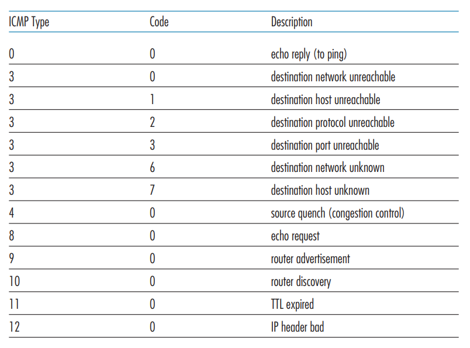
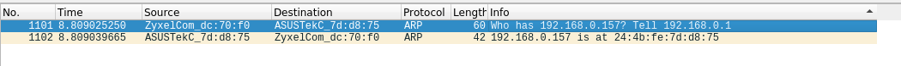
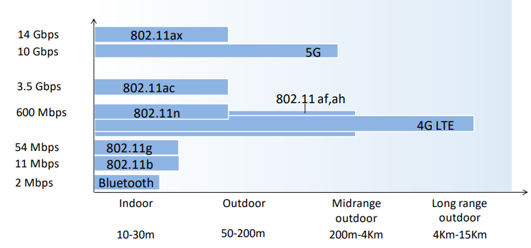
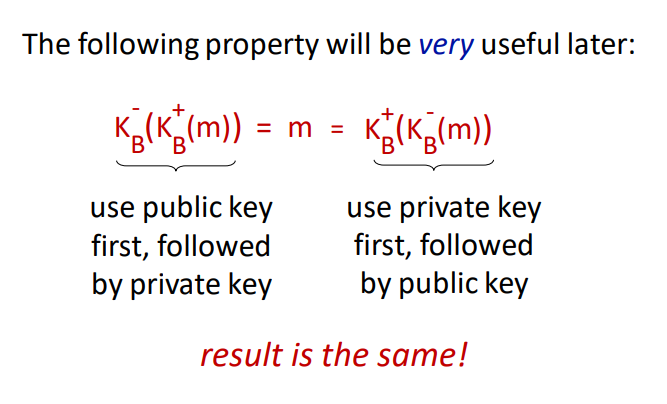

# TTM4100: Kommunikasjon - tjenester og nett

Tatt våren 2022. Nedenfor er notater for alle kapitler i boka som var i pensum.

## 01. Computers Networks and the Internet

### 1.1 What is the Internet?

The internet consists of millions of machines that are connected through various communication links and packet switches. Links transmit data over the wire at a speed of some bits per second. Packet switches are network switches that accept and forward packets to a different destination. End systems and applications communicate over the network using a set of protocols. These programs communicate over the network using network sockets.

### 1.2 The Network Edge

The network edge denotes hosts or systems at the end of the network, the machines that we interact with. These hosts are typically PCs, mobile phones, and servers. Hosts connect to the network using different methods. When stationary, you will typically connect to WiFi or Ethernet, whilst on the move, you might use DSL (digital subscribe line) to access LTE, 3G, or 4G network. These are used when on the move, as they have larger ranges than WiFi. It is also possible to access networks over satellite.

### 1.3 The Network Core

The network core denotes the mesh of packet switches and links that connect the end systems. When a packet travels across the network it uses packet switching, a routing system which means the packet travels through multiple links, finding the most effective route. This means that multiple packets from the same program do not necessarily travel the exact same route.

The packet travels at the full transmission rate of the link. A link with the transmission rate $R$ will take $\frac{L}{R}$ seconds to transmit a packet of size $L$. Store-and-forward transmission means that a packet switch must receive the entire package before forwarding the packet to the outbound link. This results in an $(N - 1)\frac{L}{R}$ transmission delay for $N$ links.

Once a packet arrives at a router, it uses a forwarding table that maps destination addresses to that router’s outbound links. To find the right outbound link, one simply looks up in this table.

Circuit switching is the other fundamental approach to transmitting packets across a network. Circuit switching differs in the way that you reserve the entire line for the transmission. This has the benefit that the connection is kept and the sender is guaranteed a constant transmission rate, but it also occupies the line and can easily waste bandwidth.

### 1.4 Delay, Loss, and Throughput in Packet-Switched Networks

There are multiple types of delay we face when transmitting packets over a packet-switched network. Among these are node processing delay, queuing delay, transmission delay and propagation delay.

Processing delay is the time required to decode the packet’s header and determine where to redirect the packet. Processing delays on modern routers are typically in the order of microseconds. After this processing is done, the router redirects the packet into the queue that precedes the link to the target destination.

Queuing delay is time the packet spends waiting in queue to be transmitted onto the link. If the queue is empty, the queuing delay is zero. If there is heavy traffic, we might expect delays between microseconds and milliseconds. Traffic intensity is the relation of $a$ packets where $\frac{La}{R} > 1$. At this point, the delay can become gigantic due to the loads of packets ending up in queue. It is therefore a goal to design routers that keep traffic intensity below $1$.

Transmission delay is the same as described in section (1.3). $\frac{L}{R}$

Propagation delay is time required to propogate from the beginnin`g of the link to the destination. It is the time it takes for the packet to travel from one node to another, denotes in distance in meters $d$ over propagation speed of the line $s$, $\frac{d}{s}$

That means that the total end-to-end delay is determine by:

$$
d_{end-to-end} = N(d_{process} + d_{transmission} + d_{queuing} + d_{propagation})
$$

### 1.5 Protocol Layers and Their Service Models

The internet protocol (IP) is split up into five protocols, each at different layers. Each layer has a set of protocols which are used to work on said level. There also exist other protocol stacks such as the OSI model.

| Layer name  | Description                                                                | Example protocols                    | Unit     |
| ----------- | -------------------------------------------------------------------------- | ------------------------------------ | -------- |
| Application | Top-level protcols working with software                                   | HTTP, SFTP, DNS                      | message  |
| Transport   | Responsible for end-to-end communication                                   | TCP, UDP                             | segment  |
| Network     | Responsible for determining where a packet is supposed to go               | IP                                   | datagram |
| Link        | Responsible for determining how the packet is moved onto the phyical layer | Ethernet                             | frame    |
| Physical    | Responsible for actually transmitting over the wire                        | Satelitte, Fiber, Twisted-pair cable | bit      |

### 1.6 Networks Under Attack

Because the Internet has become mission critical today, there is also need to protect services through cybersecurity. We typically face a few common types of attack vectors:

- Malware: software with the intention to do harm on one’s computer
- Botnet: thousands of comprimised machines used to leverage spam or denial-of-service
- Viruses: seemingly innocent programs that actually contain malware
- Worms: malware that enters a computer without explicit user interaction

It’s also possible for attackers to sniff packets that travel across the network. That’s why it’s important for websites to communicate over HTTPS which encrypts all data traveling across the wire. Wireshark is a program that can be used to sniff packets.

Attackers may also act as a trusted actor through spoofing IP-addresses or email addresses.

### 1.7 History of Computer Networking and the Internet

This chapter is less relevant to the course. The following is a tiny timeline of important events in the evolution of the Internet.

- 1972-1980: Internetworking: new and proprietary networks
- 1980-1990: New protocols such as TCP/IP, SMTP, DNS, FTP
- 1990, 2000s: Commercialization of the internet, the wide-world-web, instant messaging and social networks
- 2010+: Software as a service, streaming, cloud services

---

## 02. Application Layer

### 2.1 Principles of Network Applications

There are two main ways for applications to communicate across devices, client-to-server and peer-to-peer. Most web applications are client-to-server and are often viewed as more secure, as peer-to-peer leaks a lot of data about the other participant (such as IP address).

The transport layer protocol in use also has a significant meaning, because unlike UDP, TCP guarantees that all packages arrive at the destination. Which protocol we decide to use depends on what we’re actually doing. It might be okay to lose a few packets when streaming a movie.

Each end system application communicates with the computer network through sockets. Sockets are interfaces that emit and receive messages. When my browser visits a webpage, it opens and writes the HTTP request to a network socket. The socket is bound to a port on the end system which is how the IP protocol is able to determine where the receiving packets are supposed to go.

### 2.2 The Web and HTTP

The HyperText Transfer Protocol is the web’s application layer protcol. A web page consists of objects. An object being a file or asset that is addressable by a single URL. When the browser requests a webpage, it sends a HTTP GET request to the server which returns the document. Any linked objects are sent in individual requests after the initial document has been returned.

Because HTTP is stateless, it might be useful or necessary to send cookies alongside the HTML document. The HTTP protocol uses TCP for its transport layer protocol because you cannot afford losing parts of the HTTP response.

HTTP 1.1 and later support both persistent and non-persistent connections. Without persistent connections, each object requested by the client has to open and maintain a new TCP connection. By keeping the connection alive, the client may send multiple HTTP requests over the same TCP connection.

A web cache is typically a proxy server which caches HTTP responses from the server it’s proxying in front of. This means quicker response times for consequent requests to the same object. Typically the web cache is installed at the ISP level. A university may install a cache on its network and configure all browsers on campus to point to that cache, making consequent requests faster for everybody on campus.

### 2.3 Electronic Mail in the Internet

Simple Mail Transfer Protcol (SMTP) is a protcol for sending emails. The protocol uses 7-bit ASCII which makes it a little bit difficult to send unicode and more modern text.

The protocol works with my client sending a SMTP request to my mail server, which forwards the email to your mail server. Your mail client is then able to retrieve the email. Your client accesses the email using protocls such as POP3, IMAP or even HTTP.

### 2.4 DNS — The Internet’s Directory Service

Domain Name System (DNS) is the service that translates human-readable domain names into a server’s IP address. Querying an IP address through DNS works through a chain. My client asks the nearest DNS server if they have the domain cached. If it doesn’t, that DNS server will ask the next DNS server in line. DNS runs over UDP.

DNS is used in any service where domain name lookup is required, including email, webservers or FTP servers.

### 2.5 Peer-to-Peer File Distribution

Peer-to-Peer (P2P) networks are networks where all clients also act as servers, and clients communicate directly to eachother. As of today, the most popular P2P protocol is BitTorrent.

Upon connecting to a torrent, the client registers itself to the tracker and periodically informs the tracker that it’s still connected. The tracker returns a TCP connection which is shared among all the participants in the network.

### 2.6 Video Streaming and Content Distribution Networks

Today, video streaming has become a huge industry. HTTP streaming is one method to stream video across the web by simply storing the video at an HTTP server as an ordinary file. The problem with this approach is that all clients receive the same encoding which might not be optimal. A mobile user has different requirements than a desktop user.

Dynamic Adaptive Streaming over HTTP (DASH) is the go-to solution. In DASH, the video is encoded into several different versions, with each version having a different bitrate and quality level. Depending on the bandwidth of the client, an approriate version is selected.

To keep video streaming responsive with low latency, Content Distribution Networks (CDNs) are used. These are servers which are geographically located in different places of the world. The user will therefore get the video from the geographically closest CDN to keep latency low. It’d be a terrible experience to stream video from an American server in Australia.

### 2.7 Socket Programming: Creating Network Applications

Network applications are created by programming on network sockets. Sockets are streams where one system can send byte streams to another over a transport protocol such as TCP or UDP.

When developing a network application, the developer writes both the client and the server code. The developer can use an “open” and standardized protocol such as HTTP, or they can write their own properitary one. They also have to choose whether the protocol should run over TCP or UDP. If the developer uses a standardized open protocol, they should also use the correct port numbers defined in the RFCs for said protocol.

It’s important to note that the developer has full control over the application layer (duh, they’re writing it), but they have little control over the transport layer apart from choosing transport protocol. A server is analogous to a house, where the door is a contact point for clients. This means the server has to be running before any clients can connect.

When developing with UDP sockets, the client specifies the server IP and port number of the server process. With the client data, the IP and port the server should respond to is also provided (typically automatically by the operating system, not client application code).

When developing over TCP, the client and server first need to handshake and establish a connection. Unlike the UDP connection, the TCP server simply responds back into the socket established in the connection (instead of sending a new message over UDP). The house anology is also slightly different for TCP, as establishing the handshake is more analogous to knocking on the door first.

---

## 03. Transport Layer

Skipped 3.8 Evolution of Transport-Layer Functionality

### 3.1 Introduction and Transport-Layer Services

The transport layer is responsible for creating a logical communication layer between two end systems. This means that whatever network, link and physcal layer may be used, yet two machines should be able to smoothly communicate without worrying about the underlying infrastructure.

In the internet era, we primarily use two protocols at the transport layer, TCP or UDP. TCP provides an established connection between two end systems, allowing systems to communicate over a single connection. UDP simply allows you to send packets to a target, but there is no guarantee for ordering or arrival of said packets. Therefore the application should pick protocol accordingly. The primary job of the transport layer is to extend the IP protocol’s functionality. TCP does this by making sure that all packets arrive. TCP also provides congestion control, which controls how many packets a single system may send across the links, preventing swamping of the links.

### 3.2 Multiplexing and Demultiplexing

Multiplexing and demultiplexing is the strategy used to determine which application on a system a transport layer segment is intended for. If a user is running 5 applications on their system, it’s not clear which of the five a segment is intended for. To solve this problem, the sender multiplexes, and the receiver demultiplexes.

This is the process of attaching source IP and port, and destination IP and port to the transport layer segment header. The receiver is now able to determine which application the segment is intended for, and it is able to provide an address where the receiver may send segments back to the sender. It’s worth noting that TCP and UDP headers also have other properties in their headers, but the destination. The TPC protocol doesn’t transfer source and destination ports because it acts over an established connection, and UDP doesn’t keep the source and destination IPs.

### 3.3 Connectionless Transport: UDP

UDP is a rather barebones protocol which sits atop of the IP protocol in the link layer, and follows IPs rule of giving its best attempt to deliver the segment with no guarantees. The only steps the UDP protocol adds are the multiplexing features, containing source IP, source port, destination IP and destination port in its header along with its length and a checksum to validate integrity.

UDP is therefore favored when:

1. You want fine-grained control over what data is sent, and when it is being sent. TCP has congestion control which may delay the data which isn’t suitable for realtime applications.
2. You don’t need to establish a connection. DNS uses UDP because it doesn’t care if the packet doesn’t reach the destination, it’ll just retry with another server. You also dodge the delay of the TCP handshake.
3. You don’t want a connection state. There is also no need to keep a consistent connection, possibly allowing for more communication with more clients at once.
4. You want as little overhead as possible. The UDP header is only 8 bytes compared to TCPs 20 bytes.

Below is a table of common transport layer protocols for common applications.

The UDP header has four fields, each being two bytes each. Source port, destination port, length and a checksum. The length contains the byte size of the data + header in the UDP packet, and the checksum is used to verify the integrity of the data.

The checksum is constructed by performing 1s complement on all the 16-bit words in the packet. The receiver verifies by performing 1s complement on the data and the checksum. If the integrety of the data is kept, the result should be an all-ones 16-bit word.

The reason UDP has error-checking is because it’s designed to run atop of IP which should function on about any layer-2 infrastructure. It’s a backup to ensure that no error has occured during transit, regardless of what other error checking the lower layers perform.

### 3.4 Principles of Reliable Data Transfer

Reliable data transfer is all about ensuring that all packets arrive at the target destination, and in the correct order. To ensure this, we need an Automatic Repeat Request protcol (ARQ). It has the following components:

1. Error detection: a way to detect bit errors,
2. Receiver feedback: a way to have receiver send back acknowledgement or not-ackowledged packets to determine further action,
3. Retransmission: a way to re-transmit packets.

To keep track of what packets make it and which don’t, we introduce a sequence number which is incremented for each packet. In a stop-and-wait protocol we don’t need to reply with which sequence number was acknowledged, because there’s only one packet in transmission at a time. In these protocols, the sequence number is either 1 or 0.

The sender may also have a timer, and if there is no acknowledgement by the end of the timer, it’ll re-send the packet. In typical protocols, one re-sends the packet after a reasonable time, which may lead to duplicate packets. Duplicate packets are not a concern, because we’ll simply ackowledge the first, and discard the second.

It’s extremely inefficient to operate on a single packet at once, which is why pipelining protocols are the standard. Pipelining allows for sending multiple packets without waiting for acknowledgement. This strategy comes with the following consequences:

1. The number range of sequence numbers must be bigger (since we’re not operating on 1 and 0 anymore)
2. The sender and receiver have to buffer more packets (because there are multiple packets in transmission at once)
3. Both of the above factors are determined by the recovery strategy. Common ones are Go-Back-N and Selective-Repeat

The Go-Back-N strategy allows $N$ unacknowledged packets in the pipeline at once, meaning if $N=8$, then packet 11 cannot be sent before $0..3$ are ackowledged. $N$ is often referred to as the window size, and Go-Back-N is the window sliding protocol. The protocol sender has to respond to the following events from the receiver:

1. Invocation from above: when the application layer sends packets, we have to determine if the window is full. If it’s full, we’d theoretically send the packets back to the application, but in reality we buffer the packets or lock it with a semaphore/mutex.
2. Receipt of an ACK: when an acknowledgement of sequence number $n$ is received, we assume all packets up until and including $n$ are received.
3. Timeout event: if a timeout event is received, we’ll try to re-send all $N$ unacknowledged packets in the window.

Selective-Repeat differs from Go-Back-N in the way that it may send and/or receive packets out of order which are buffered and pieced together in the right order at the receiver. Only the errored packets are being requested to be retransmitted instead of the entire window in Go-Back-N.

### 3.5 Connection-Oriented Transport: TCP

TCP is a transport layer protocol which contains ensures reliable data transfer. It is also:

- A full-duplex service, meaning communication can go both ways
- A point-to-point service, meaning communication only occurs between two end systems
- Connected by a three-way handshake. Client sends a SYN, expecting a SYN-ACK and confirming connection with an ACK.
- Buffers data in a send buffer. When either system wants to send data, it’s sent to the TCP send buffer which will, depending on the data size partition it into multiple segments and send them to the other end. The maximum segment size (MSS) is typically determined by the length of the largest link-layer frame minus the size of the TCP header (40 bytes).

The TCP header is a 20-to-60 bytes long header appended to each TCP segment. It contains the following special fields:

1. Sequence number: if the SYN flag is set, this is the first sequence number, otherwise accumulated sequence number for the first byte of data
2. Acknowledgement number: if the ACK flag is set, this is the next expected sequence number the sender expects.
3. Data offset: byte offset into the header where the data can be expected (options may be 0-40 bytes large)
4. Reserved: unused data, reserved for future use
5. Flags (URG, ACK, PSH, RST, SYN, FIN): different flags for different TCP message types
6. Window size: amount of window size units the sender is currently willing to receive
7. Checksum: 16-bit checksum to error-check the TCP header
8. Urget pointer: if the URG flag is set, then this is a sequence number offset from the sequence number with the last urgent byte.
9. Options: variable length TCP options (see [https://en.wikipedia.org/wiki/Transmission_Control_Protocol#TCP_segment_structure](https://en.wikipedia.org/wiki/Transmission_Control_Protocol#TCP_segment_structure))

The reliable transmission over TCP is done with a single timer. The timer tracks the last packet which has not received an ACK yet. If the timer runs out, the packet is resent. The timer restarts every time an ACK of higher sequence number has been received.

TCP uses a modified Go-Back-N and Selective-Repeat strategy called Selective-Acknowledgement which allows TCP to acknowledge out-of-order segments selectively allowing us to only re-transmit what has not been acknowledged.

### 3.6 Principles of Congestion Control

Congestion control is a solution to the problem where the hosts transmit enough data quickly enough to overflow the network layer and its buffers, resulting in dropped packets (because network layer buffers are full). This means the transport layer might re-send packets that’ll get dropped regardless and it’ll cause huge delays.

We have two types of congestion control; end-to-end and network-assisted. In end-to-end congestion control, the network layer does not give any feedback to the transport layer about congestion control, so it’s up to the transport layer to reduce load. In network-assisted congestion control the network layer might provide bits or flags to hint at congestion at a link which would allow the transport layer to reduce load.

### 3.7 TCP Congestion Control

TCP adjusts its transmission rate based on how congested it percieves the connection to be. It starts with a maximum transmission rate it will lower as necessary. If TCP notices a timeout or a triple ACK then the rate should be reduced. The rate of increase is based on how quick it receives ACKs from the other end. TCP follows these principles to determine when to change rate:

1. Lost segments imply congestion, therefore rate should be decreased
2. Acknowledged segments imply segments arrive, therefore rate may be increased
3. Triple acknowledgement is often caused by congestion or a timeout, therefore rate should be decreased.

TCP also uses the following algorithms to determine how much the rate should be changed:

1. Slow-start: start by transmitting at $rate=1MSS/RTT$, doubling rate for each acknowledged segment. This leads to exponential growth. If there is a loss event, it re-starts at $rate=1MSS/RTT$, while keeping track of the rate at the time of the loss event $lrate = \frac{rate}{2}$. Once the new rate reaches the old rate divided by two ($lrate$), TCP enters congestion avoidance mode.
2. Congestion avoidance: preserve the current rate $irate = rate$ and keep adding $rate += 1MSS/RTT$ to the rate until a new loss event occurs. Upon loss event, the rate is reduced to halv of the congestion avoidance mode added rate. In case of triple ACK, 3MSS is also removed to account for the triple ACK segments. TCP enters fast-recovery mode.
3. Fast recovery: in fast recovery, rate is increased by 1MSS for each duplicate ACK received after the missing segment which caused fast-recovery. Once the ACK for the missing segment is received, TCP enters congestion-avoidance mode again. If a timeout occurs, it jumps to slow-start again.

TCP is decently fair if all traffic on the link was TCP, but the algorithm isn’t necessarily fair if there’s other traffic such as UDP which doesn’t care for other transports.

---

## 04. The Network Layer: Data Plane

### 4.1 Overview of Network Layer

The network is the layer responsible for sending the data to its target destination. It does this through two methods; forwarding and routing.

- Forwarding: upon receiving a packet, the router determines which link to forward it to
- Routing: the end-to-end process that determines all the nodes in the network a packet should be forwarded through

One should also be aware of the difference between software and hardware level routing.

The IP protocol is a best-effort protocol which means it has no guarantees for packets reaching the other end or order of packets.

### 4.2 What’s Inside a Router?

A router formally consists of four parts; input ports, switching fabric, output ports, and a routing processor.

- Input ports: packets arrive and look into the lookup table to determine which output port to transfer to.
- Output ports: packets exit through the output ports
- Switching fabric: hardware which guides the packets from the input ports to the output ports
- Routing processor: typically hardware which decides what goes where, but could also be software. Hardware is a lot quicker here, and typically preferred.

Deciding which output to forward to can be decided in multiple ways, but is usually decided by the destination address in the IP datagram. This is usally destination based forwarding with longest prefix matching.

Switching in the fabric can be done in multiple ways including in-memory, bus, or crossbar.

- In-memory is simply copying the input packet into memory and delivering it to the right port. This is slow because only one read/write operation may happen in memory at any time, making it slow for multi-port routers.
- Bus: uses a bus system to transfer packets to all ports, but only the forwarding port keeps the packet. This causes a bus bottleneck because all packets travel through the bus.
- Crossbar, or interconnection network uses a set of buses between the inputs and outputs that may be opened or closed. This makes it possible for data to flow to multiple ports in parallell, but will still slow down if two packets from different input ports are going to the same output port.

When we talked about packet loss in the transport layer, we were talking about queue loss. Queue loss happens when there becomes a bottleneck in the switching fabric, and packets are lost because the queue becomes too big.

HOL-queuing is when two packets in the same input are going to different outputs, but the front packet’s output already has a queue. This means the second input packet is queued due to the first input packet.

Most routers can handle some queuing by keeping a packet buffer which acts as a queue. Anything outside of the buffer size will be lost. We can also prioritize different packets over other based on their type of class in the IP datagram header. The question is how to make this fair?

This is also where net-neutrality comes in, should one be able to pay for priority here? (No, ple

### 4.3 The Internet Protocol (IP): IPv4, Addressing, IPv4, and More

The IP protocol has two major versions in use; v4 and v6. IPv4 is old, and we are actively trying to move away from it. It has the following header datagram.

- Version: denotes which IP version is in use (because IPv6 headers are different).
- IHL: The length of the whole leader (because IPv4 headers are variable-length)
- TOS: Type of service that can allow above layers to distinguish diagrams (such as priority for realtime apps)
- Total Length: The length of the entire datagram
- Identification, flags, fragment offset: IP Fragmentation related - not in curriculumn
- TTL: Amount of router the diagram can pass through before having to be discarded. (Decreased at each router, 0 means router should discard).
- Protocol: Transport layer protocol number, see [https://www.iana.org/assignments/protocol-numbers](https://www.iana.org/assignments/protocol-numbers)
- Header checksum: 1s-complement of every two bytes interpreted as an integer checksum
- Source address: IP address of origin
- Destination address: IP address of target destination
- Options: Possibly extend an IP diagram, rarely used
- Data: actual data in the diagram

Addressing in IPv4 is a complex task. IP addresses are managed by ICANN (who also manage domain names and root DNS servers).

A subnet is a part of an IP address, and usually have reserved $n$ bits of an address. The indicates 123.57.21.3/24 indicates that it’s an address in the 123.57.21.x subnet. The number after the slash indicates how many bits from the left are part of the subnet. ISPs typically get a subnet dedicated to them, then they can split that among their customers.

On each network, you will typically get your address in the subnet automatically through the DHCP protocol. It’s a protocol designed to hand out spaces in the subnet to devices. It’s a server-client protocol. Your device contacts the DHCP server and receives an address. DHCP can use and store metrics about the device if you, for example, wish to give the same address to the same device.

On local networks you can set up a NAT on a subnet. This is a private network which means you can re-route addresses (that may be used outside the NAT) locally. This is one way to “get more” IPv4 addresses than there exist (because they can be hidden private behind a NAT).

Because we are running out of IPv4 addresses, is IPv6 the new version with a 128-bit address (as opposed to IPv4’s 32 bits). Its header looks like this.

- Version: 6 in IPv6
- Traffic class: Same as type of service in IPv4
- Flow label: Ability to label packets that belong to the same flow that the sender wants to be treated differently. Example flows being realtime audio or video.
- Payload Length: Same as Total length in IPv4
- Next header: Same as Protocol in IPv4
- Hop limit: Same as TTL in IPv4
- Source address: Same, but 128 bits
- Destination address: Same, but 128 bits
- Data: Same as in IPv4

Transition from IPv4 is not easy. It’s not possible to replace all devices like some may think (there are billions of devices). Instead we can trick IPv4 hardware to deliver IPv6 by wrapping the entire IPv6 datagram in an IPv4 payload. (Set IANA number to 41 in IPv4 header).

### 4.4 Generalized Forwarding and SDN

To make it easier and more customizable to perform forwarding (as well as extend existing functionality), the OpenFlow protocol was developed. It’s a protocol that allows servers to tell network switches where to send packets based on a match-plus-action scheme.

There exists a table with matching patterns that will map to actions such as forwarding, dropping, rewriting, or duplicating packets. This makes it very easy to create load balancers on the network level or other software such as firewalls.

### 4.5 Middleboxes

A middlebox is any intermediary box performing functions apart from normal, standard functions of an IP router on the data path between a source host and destination host.

They’re essentially services that allow us to modify the packets between end systems. Examples are NATs, firewalls, load balancers or caches.

---

## 05. The Network Layer: Control Plane

Includes chapters 5.1, 5.2, and 5.6 only.

### 5.1 Introduction

As opposed to the data plane, the control plane determines the full route for a diagram or packet instead of which outbound link to forward to like the data plane does.

Traditionally, the routing has been done per router where a routing algorithm runs in each and every router, meaning both forwarding and routing functions are contained in each router. Examples of per router protocols are OSPF and BGP.

Logically centralized control is software-based control where a centralized controller computes and distributes forwarding tables to be used in each and every router. SDN is an example of logically centralized control, where the main server communicates to each router to define rules.

### 5.2 Routing Algorithms

Routing algorithms view the network of routers as a graph, $G = \langle N, E \rangle$ where $N$ is the set of nodes, and $E$ is the set of edges. Each edge may be assigned a cost which is used to judge how expensive (in terms of latency, etc.) taking one route (edge from $N_1 \to N_2$) is. If all costs are equal, the cheapest path is the path with the fewest nodes.

It’s not as simple as figuring out the cheapest path, because organization $X$ may rule that none of their data should go through links in organization $Z$ network, making the matter more difficult.

There are primarily two types of routing algorithms:

1. Centralized routing algorithm: this algorithm knows every node, edge, and cost in the networking, making it easy to determine the lowest cost path. These are so-called Link-State algorithms (LS).
2. Decentralized routing algorithm: calculation is done in an iterative, distributed manner by the routers. No node in the network has knowledge of all costs, so by exchanging information with its neighbors, the routers can determine costs. An example is a distance-vector algorithm (DV).

A link-state algorithm knows about the costs of each node in the network, making it possible to determine the cheapest way easily. This can be done with Dijkstra’s algorithm for finding the shortest path between a weighted graph. It’s quite performant, but there may occur oscillations if the cost is based on link traffic because you may overload a smaller route because it had little traffic when measured.

In a decentralized routing algorithm, each node waits for a change in local link cost (maybe the neighbor disconnected/lost another link), then you should recompute an estimated distance. If the distance has changed, you should notify your neighbors.

### 5.6 ICMP: The Internet Control Message Protocol

ICMP is a protocol that architecturally lies on top of the IP protocol (such as TCP/UDP). It is used between routers to communicate for use in their routing algorithms. ICMP has a set of pre-defined messages that may be sent.

---

## 06. The Link Layer and LANs

### 6.1 Introduction to the Link Layer

The link layer is responsible for transporting frames from one node to another. This can happen over multiple communication channels that can be wired or wireless.

The link-layer may provide several services such as:

- Framing: encapsulate datagram into the frame, adding header + trailer.
- Reliable delivery between adjacent nodes: rarely ever used on wired links because these are pretty reliable.
- Flow control: pacing between adjacent sending and receiving nodes
- Error detection: detect errors caused by signal attenuation, noise, etc. The receiver detects an error, signals retransmission, or drops the frame.
- Error correction: receiver identifies and corrects bit errors without retransmission.
- Half-duplex and full-duplex: nodes at both ends of the link can transmit, but not at the same time

The link layer is typically implemented in hardware or a Network Interface Card on the node’s physical chip.

The sending side on the link-layer encapsulates the datagram into a frame, adding error-checking bits and other services the node provides. The receiver can use these services to look for errors or request retransmission before extracting the datagram and passing it to the next layer.

### 6.2 Error-Detection and -Correction Techniques

Error detection at the link layer is not 100% reliable meaning that some protocols may miss errors under extreme conditions. There are typically three different techniques in use:

1. Parity checking: set a parity bit such that there is an even amount of 1’s in the datagram + parity bit. This can be done two-dimensionally, checking both column and row. Two-dimensional parity checking may also be able to do some corrections.
2. Checksum: uses the same checksum method as the Internet Checksum, treating datagram contents as a sequence of 16-bit integers and performing a 1-s complement on them.
3. Cyclic Redundancy Check (CRC): this method is widely used in practice. Sender and receiver determine a number $G$, and for each $D$ bit of data, we add $r$ bits $R$ such that $\frac{d * 2^r}{G} = R$.

### 6.3 Multiple Access Links and Protocols

Multiple access protocols are needed where multiple nodes broadcast to multiple nodes at the same time. You cannot broadcast two messages at once, because you wouldn’t be able to piece them together later. There are three types of Media Access Control (MAC) protocols.

1. Channel partitioning: each node receives time where they can send packets. TDM divides time into time frames, where each node gets a slot. Maximum speed is thus $\frac{R}{n}$ for $R$ speed over $n$ nodes. FDM also gives each node a frequency. This means FDM only works with analog signals.
2. Random Access Protocols:
   1. Slotted ALOHA: Splits time into slots large enough to transfer a frame. Nodes transmit when needed, and if a collision occurs, each node has a $p$ probability of retransmitting the next slot, otherwise, wait until the next.
   2. ALOHA: Same as slotted ALOHA, except there is no synchronizing of slots. This means frames may overlap, and the probability of collision is higher.
   3. Carrier Sense Multiple Access: Ask other nodes if they are sending something, if nobody else is transmitting, transmit yourself. Collisions may still occur due to propagation delay
   4. Carrier Sense Multiple Access with Collision Detection: Attempt to send. If a collision occurs, use an exponential backoff algorithm to determine how long to wait until re-trying.
3. Taking turn protocols:
   1. Polling protocol: The master node determines when other nodes can send frames
   2. Token passing protocol: There is a token passed around, which lets nodes communicate who should transmit. If a node isn’t transmitting, it’ll just pass the token to the next node.

### 6.4 Switched Local Area Networks

Each network adapter (one might say router, but it’s actually the adapter) has its own MAC address. This is a 48-bit address typically written in hexadecimal notation.

MAC addresses are unique globally, and they’re distributed by the IEEE, meaning manufacturers can buy ranges of MAC addresses to assign to their adapters. Each interface on a LAN has its own adapter, and thus its own MAC address.

To determine an interface’s MAC address, knowing its IP address is done through the Address Resolution Protocol (ARP). Each IP node on the LAN has an ARP table used to map IP addresses to MAC addresses. This works similarly to DNS, except ARP requests will be broadcast across the entire LAN (as opposed to DNS typically contacting one DNS server)

When sending a frame to a router, targeted for another host in the network, the sender must set the target MAC to the router’s MAC, otherwise, the router’s adapter will simply drop the frame.

Ethernet is a protocol for wired LAN technology from the 1980s, becoming the most used and widespread LAN technology in use today. Ethernet is typically placed behind a switch on a network. An ethernet frame has a payload between 46 and 1500 bytes

The preamble consists of a 56-bit pattern, allowing devices on the network to easily synchronize their receiver clocks. (Not sure what the actual purpose of this is). The type indicates the higher layer protocol (typically IP, but might be others. This is used to demultiplex up at receiver).

Ethernet is connectionless and unreliable, meaning if the higher layer doesn’t provide reliable data transfer, you might lose frames without knowing. There are also multiple standards for different speeds and physical media, but the frame format is common for all.

A switch is a link-layer device that stores and forwards Ethernet frames among a local set of hosts. It examines incoming frame’s MAC addresses, and selectively forwards these to one or multiple links. Uses CSMA/CD to access segment. It’s also transparent, meaning hosts are completely unaware that a switch is connected. They do also not need any configuration.

The switch uses the ethernet protocol on each incoming link, such that there are no collisions, it’s full-duplex and each link is its own collision domain. This means that transmission to $A \to A’$ and $B \to B’$ may happen simultaneously without collisions (but $A \to A’$ and $B \to A’$ can’t).

A switch has a self-learning forwarding table. It keeps the MAC address of each connected host, the physical interface to reach the host, and a time-to-live timestamp. It’s similar to a routing table. When frames are received, the switch “learns” the location of the sender by inspecting the MAC address and associating it with the link it came from.

If an incoming frame doesn't have an entry found, it’s broadcast to the entire network (apart from the arriving link). If the destination is the same as the sender the frame gets dropped. Otherwise, it’s forwarded to the frame as indicated in the switch table.

Switches are similar to routers but serve a different purpose. Routers operate on IP addresses using routing algorithms, whereas switches operate on MAC addresses by learning about their neighbors themselves.

Virtual local networks are networks made for scale. With a single broadcast domain you get a scaling problem when ARP, DHCP, unknown MACs, etc. must all traverse across the entire network. It’s also a security concern because all of those messages are broadcast to the entire network.

There are two primary types of VLANs:

1. Port-based: ports on the physical switch are grouped together by switch management software such that they act as a single switch. It allows dynamic membership (as ports are dynamically assigned through software) and forwarding between VLANs is done via routing. In practice, this is done by selling switches that have routing functionality in them.
2. MAC-address based: groups nodes on the network by their MAC addresses. Also configurable through software.

VLAN frames differ slightly from the regular Ethernet format in the way you need a Tag Protocol Identifier (TPID) of two bytes and a Tag Control Information attached (which results in the Ethernet CRC being recomputed). Any traffic leading out of the VLAN discards this info as it’s only used for internal routing.

### 6.5 Link Virtualization: A Network as a Link Layer

Multiprotocol label switching (MPLS) is a “protocol” sitting between the Ethernet (or other) and IP (or other) layer with the goal of making high-speed IP forwarding possible by doing lookup using a fixed-length identifier.

It forwards packets to the outgoing interface based only on the label value, meaning it doesn't have to look into the IP address at all. MPLS routers have their own forwarding tables which are used when frames arrive.

### 6.6 Data Center Networking

Data centers are networks with hundreds of thousands of hosts, closely coupled in close physical proximity. This is used for large online services like streaming, search engine, expensive computation, and so on. The biggest challenges faced are reliability and how to optimize the networking across these machines.

In a data center, machines are stack into racks, which each have their Top of Rack (TOR) switch. These switches are typically interconnected at another layer. This is what Facebook’s F16 data center topology looks like.

There have been plenty of neat innovations with the development of data center networks and networks on a large scale. SDN is widely used within data centers, and features like RoCE at the link layer are also commonly used.

### 6.7 Retrospective: A Day in the Life of a Web Page Request

In this scenario, Bob connects to a webpage using his school’s ethernet. This is the sequence of events that unfold:

1. Bob’s operating system produces a DHCP request message and puts this into a UDP segment with port 67 (DHCP server). This is put into an IP datagram with the broadcast destination address 255.255.255.255 and a source of 0.0.0.0 since Bob has no IP as of now.
2. The IP datagram is put inside an Ethernet frame with destination MAC of ff:ff:ff:ff:ff:ff to be broadcast over all devices on the switch. The frame has a source MAC of Bob’s network adapter.
3. The router receives the Ethernet frame, and the MAC and IP are extracted from the frame. The broadcast IP indicates that it should be demultiplexed at this stage, and the UDP segment is extracted. The UDP segment is demultiplexed such that the DHCP message is revelaed. The DHCP sever now has the DHCP message.
4. The DHCP server allocates a new address, and forms a DHCP ACK message containing the IP, as well as the IP of the default DNS server. This is put back into a UDP segment, wrapped in an IP datagram, wrapped in an Ethernet frame headed for Bob’s computer.
5. The frame with the DHCP ACK is cast out to the switch again, which knows where to direct the MAC address, because it learnt Bob’s MAC address and physical interface when Bob sent the DHCP request.
6. Bob receives the DHCP ACK message, and his DHCP client records the assigned IP address as well as the DNS server address.
7. Bob’s web browser creates a TCP connection which will be used to handle transport the HTTP request. Before it can do so, it needs the IP of the target webpage. This is done with DNS.
8. Bob’s operating system creates a DNS query, wrapped in an UDP segment, wrapped in an IP datagram with a destination address of the default DNS server returned in the DHCP ACK message.
9. Because Bob’s computer only knows the IP address of the gateway router it needs to acquire its MAC address. It creates an ARP query placed in an Ethernet frame which is broadcast with a destination address of ff:ff:ff:ff:ff:ff.
10. The gateway router notices that it’s the requested node, and prepares an ARP reply with its own MAC address in an Ethernet frame which is to be sent back to Bob. Bob can finally send his DNS query because he has the details needed to send frames to the gateway router.
11. Bob’s gateway router receives the frame and unwraps it to find the destination IP address contained in the IP segment and determines the outgoing interface from its forwarding table.
12. The frame finally reaches the DNS server where a DNS reply is formed and is sent back to Bob’s laptop which extracts the IP address from the reply.
13. The TCP socket connection is established through the three-way-handshake (SYN, SYN ACK, ACK), and a HTTP GET request is formed.
14. The receiving server handles the HTTP GET request and forms a HTTP response which is sent back to Bob’s browser which renders the web page.

---

## 07. Wireless and Mobile Networks

### 7.1 Introduction

Wireless networks are, well, networks that are not connected by wire. They consist of:

- Wireless hosts: end-system devices that run applications that are connected to the network. They may be stationary, wireless doesn’t always mean mobile. Examples are your phone, tablet, or laptop.
- Base stations: infrastructure responsible for relaying packets between wireless hosts. Examples are cell towers or 802.11 access points.
- Wireless links: links to connect devices to the base station. Examples are satellite communication, Bluetooth or 5G

Different wireless links have different characteristics, so they should be selected wisely.

There are two operation modes for wireless networks:

1. Infrastructure mode: base station connects mobiles to a wired network, and mobile changes base station providing connection into a wired network
2. Ad-hoc mode: no base stations and nodes can only transmit to other nodes within link coverage. Nodes organize themselves into a network, routing among themselves

|                   | Single Hop                                                             | Multiple Hops                                                                           |
| ----------------- | ---------------------------------------------------------------------- | --------------------------------------------------------------------------------------- |
| Infrastructure    | Hosts connect to base station, which connects to larger internet       | Hosts may have to relay through several wireless nodes to larger internet (mesh net)    |
| No infrastructure | No base station to connect to larger internet (Bluetooth, ad-hoc nets) | No base station, no connection, may have to relay to reach other a nodes (MANET, VANET) |

### 7.2 Wireless Links and Network Characteristics

Wireless linking and networking has some key problems such as:

1. Decreasing signal strength: electromagnetic radiation attenuates as it passes through matter, leading to possible path loss.
2. Interference from other sources: radio sources transmitting in the same frequency will interfere with each other
3. Multipath propagation: happens when electromagnetic waves reflect off objects and the ground, taking paths of different lengths between a sender and receiver. Moving objects between sender and receiver might also cause this.

Signal Noise Ratio (SNR) is a measurement to measure the strength of a received wireless signal. The higher the SNR, the better.

- Given the physical layer, increase power, leads to increased SNR, which leads to decreased bit error rate (BER)
- Given SNR, choose a physical layer that meets BER requirements, giving the highest throughput.

There are also other problems that you wouldn’t typically come across in a traditional wired network. An example is the hidden terminal problem. Say link A is transmitting to B, but at the same time, C is also transmitting to B. This would be fine, however, A and C are on the opposite sides of a mountain with a lot of interference. Neither A nor C is then capable of knowing that they’re interfering with B.

Code Division Multiple Access (CDMA) is a way for multiple nodes to communicate simultaneously.

Each node or user is assigned a unique code that is used to encode data. This allows multiple nodes to coexist and transmit because their data can be distinguished.

[Code-division multiple access - Wikipedia](https://en.wikipedia.org/wiki/Code-division_multiple_access)

### 7.3 WiFi: 802.11 Wireless LANs

IEEEs 802.11 Wireless LAN standard has become the main standard for wireless LAN networking, with multiple versions featuring different characteristics over the years.

The 802.11 architecture consists of a wireless host that communicates with a base station (AP). (or in the case of ad-hoc mode, hosts only).

The AP node admin selects a frequency for the AP which means interference between AP nodes is possible. When the arriving hosts connect, they must associate with an AP on the network.

AP nodes send out beacon frames which arriving hosts can listen for and respond to establish a connection with the AP. These frames are typically sent out every 100 milliseconds. An arriving host can also do active scanning, probing for APs in range, and establishing a connection this way.

802.11 also needs a media access control scheme to work with multiple hosts on the same AP station. It uses the same random access CSMA protocol as Ethernet, except it uses collision avoidance instead of collision detection. Collision detection is a problem with wireless LANs as you end up just blocking the channel, and it’s also impossible to detect if other users on the network are using the channel (due to the terminal problem described above)

An extension to this CSMA/CA standard is adding an RTS (right to send)/CTS (clear to send) packets to the AP, which acts as a controller for which hosts may send. Hosts must send an RTS packet and receive a CTS before transmitting.

802.11 also has some advanced capabilities when changing stations, allowing connections like TCP connections to stay open while the host changes AP stations on the same network. It also has a power management feature, allowing hosts to tell the AP they’re going to “sleep” until the next beacon frame, informing the AP not to send any frames to the host, and instead buffer them until the host is awake again.

### 7.4 Cellular Networks: 4G and 5G

---

## 08. Security in Computer Networks

Missing 8.8

### 8.1 What is network security?

Network security encompasses the following aspects in an attempt to keep the Internet safe:

1. Confidentiality: only the sender and intended receiver should be able to read message contents. This is done with encryption.
2. Authentication: sender and receiver want to confirm each other's identity.
3. Message integrity: sender and receiver want to ensure the message was not altered.
4. Access and availability: services must be accessible and available to users.

If these principles are not followed, possible attackers may eavesdrop and intercept messages, modify the messages, spoof and impersonate others, hijack the session or perform denial of service attacks.

### 8.2 Principles of Cryptography

There are two main key cryptography techniques: symmetric-key cryptography and public-key cryptography:

- Symmetric-key cryptography is encryption where both parties share the same key. This is difficult on the internet because it takes for granted that both parties know the key (which they couldn’t securely exchange in the first place).
- Public-key cryptography is encryption where both parties have a publicly available key and a secret key. Communication happens when the sender uses the receiver’s public key to encrypt the message. The receiver can use their own secret key to decrypt the message.

Block cipher algorithms split the message up into blocks and encrypt these separately. This method has a weakness because duplicate segments will always encrypt to the same thing. To resolve this, cipher block chaining is used which will send a random first message which is used to encrypt the blocks in a chain.

$c(I) = K_s(m(i) \oplus c(i - 1))$

RSA computes a public key private pair by choosing two large primes $p, q$. These primes usually have upwards of 1024 bits each. (or more for rsa2048, etc.)

1. Compute $n = pq, z = (p-1)(q-1)$
2. Choose $e < n$ where $n$ has no common factors with $z$. ($e, z$ are relatively prime)
3. Choose $d$ such that $ed - 1 mod z = 1$
4. Public key is $(n, e)$ and private key is $(n, d)$

Encryption using RSA is performed as follows:

1. Encrypt message $m$ = $c = m^e mod n$
2. Decrypt pattern $m = c^d mod n$

The reason RSA is secure is because you need to find factors of a prime number without knowing factors $p$ and $q$. When the prime has upwards of 1024 bits or more, it requires immense amounts of computing power.

RSA is computionally exponentially expensive. A typical exchange can instead use RSA to exchange a symmetric session key which can be used with symmetric-key cryptography later.

### 8.3 Message Integrity and Digital Signatures

A receiver must be able to verify that the message was actually sent by the intended sender and that the message hasn’t been modified in transit.

Cryptographic hash functions are mathematic functions that take an input string $m$ and compute a hash of a known size (depending on the algorithm used). For any hash function, it must be computationally infeasible to find two messages $x$ and $y$ such that $H(x) = H(y)$. This is a hash collision and that’s bad.

A message authentication code (MAC) is a technique used to verify that the sender actually sent the message. This is done by exchanging a secret HMAC code $s$ which is used together with the message to compute the hash. The sender then sends $(m, H(m+s))$ to the receiver, which confirms by computing $H(m+s)$ themselves and verifying the hash. The most MAC today is HMAC.

A digital signature must be verifiable and impossible to impersonate. One way to add a digital signature is to encrypt the message or hash with one’s private key. The receiver can then use the sender’s public key to decrypt the message or hash to verify. For this to work, we need to ensure that the public key sent actually belongs to the sender. This is done by a Certification Authority (CA) which binds a public key to a person or unit and adds their own CA-signed certificate to verify that the public key belongs to the entity.

### 8.4 End-Point Authentication

Secure end-point authentication can typically be done with a password, but there are extra measures we need to take:

1. If there’s just a plaintext password, someone may eavesdrop and steal the password in transmission
2. If we encrypt it, someone may perform a playback attack
3. If we encrypt it with a nonce and encrypt it using symmetric-key cryptography, then the receiver can decrypt it using the key and verify the nonce.

### 8.5 Securing E-Mail

Security measures are taken at each layer in the network model to preserve confidentiality, message integrity, and authentication. One way to do this is as follows:

- Sender: generates symmetric private key $K_s$
- Sender: encrypts the message with $K_s$ for efficiency (instead of encrypting with private/public key)
- Sender: encrypts $K_s$ with receiver’s public key
- Sender: sends both $K_s(m)$ and $K^+_r(K_s)$ to receiver $r$
- Sender: signs and sends hash of her message with her private key $K^-_s$

The receiver may then:

- Use sender’s public key to recover hash
- Use his private key to recover $K_s$
- Use $K_s$ to decrypt $m$
- Validate the message and hash

### 8.6 Securing TCP Connections: TLS

Securing the transport layer is important to prevent people from stealing information from the application layer. If there was no security in place, attackers could steal your credit card information when purchasing something from Amazon or other important pieces of data.

TLS has three stages; handshake, key derivation, and data transfer

- The handshake stage: TCP connection is created. Accepts the server’s public key and verifies it against the CA. Create Secret Master Key and encrypt it with the server’s public key. The server decrypts the encrypted Secret Master key.
- The key derivation stage: Generates four keys: A-B encryption key and A-B HMAC, B-A encryption key, and B-A HMAC. These keys are derived from the Secret Master Key which is why it’s called the key derivation stage. Both parties know of all four keys + Secret Master Key now.
- Data transfer is split into records, add a MAC, and encrypt with the corresponding key. Reverse the process at the receiving end. Individual sequence numbers are also used to prevent attacks from removing, replaying, or shuffling records.

### 8.7 Network Layer Security

IPsec provides datagram-level encryption, authentication, and integrity. It has two operation modes; transport and tunnel.

1. Transport mode: only the datagram payload is encrypted and authenticated
2. Tunnel mode: entire datagram is encrypted, and it’s encapsulated in a new datagram with new IP header

There are two primary IPsec protocols: AH and ESP. Both provide source authentication and data integrity, but AH does not provide confidentiality.

Before transmission, a security association is established. It’s unidirectional so you need two to communicate. IP is connectionless, but IPsec is connection-oriented.

At the source router:

1. Append ESP trailer to original datagram
2. Encrypt result using algorithm and key specified by SA.
3. Append the ESP header in front of the result
4. Create authentication MAC using algorithm and key specified by SA.
5. Append MAC, forming the final payload
6. Create a new IP header with the payload

IPsec uses sequence numbers, initialized to zero which is increased each time a datagram is sent on the SA. This is to prevent sniffing and replay attacks.

Setting up the SA for each router is impractical for large networks with thousands of endpoints. Instead, we use IPsec Internet Key Exchange (IKE).

### 8.9 Operational Security: Firewalls and Intrusion Detection Systems

Firewalls have three goals; allow authorized people through, deny intruders, and be impenetrable themselves. There exist three types of firewalls:

1. Traditional Packet Filter: inspects each diagram, and decides based on datagram information to let through. Typically based on protocol, host, TCP flags, etc.
2. Stateful Packet Filter: tracks TCP connections to block non-sensical packets.
3. Application gateway: Filter packets on application data to a specific application. Blocks all application connections not originating from the gateway.

Firewalls have a few limitations, namely:

- IP spoofing cannot be detected.
- If multiple apps need special treatment, each will need its own gateway.
- Client software must know how to contact the proxy gateway.
- Filters often use an “all or nothing” policy for UDP.
- Highly protected sites still suffer attacks.

Intrusion detection systems operate on TCP/IP headers only and have no correlation check on sessions. They examine strings in the packet against know viruses or attack strings.

They also examine the correlation among multiple packets to prevent port scanning, networking mapping, and denial-of-service attacks.

---

## 09. Multimedia Networking

### 9.1 Multimedia Networking Applications

A multimedia networking application is any application that employs audio or video.

Video applications dominate the internet traffic volume, so it’s important to do what we can to reduce the bandwidth used. Video is extremely expensive because it’s essentially a stream of images that are being sent across the network. We usually compress video.

Audio and images are substantially cheaper, but those also depend on how they’re transferred, and if they’re compressed or not.

Media may be compressed at different levels to reduce bandwidth usage. We may also want to compress multiple times at once for clients that are on lower bandwidth connections such as mobile viewers of an online conference.

There are also trade-offs to be considered depending on what media is being transmitted. Hiccups in the video are typically alright, but if audio keeps cutting it becomes a huge problem.

### 9.2 Streaming Stored Video

Streaming video is preferably done at a rate matching what the client is using to watch the video. There are a couple of ideas possible for streaming stored video:

- UDP Streaming: stream over UDP where video might be lost, but that can be made up for because of a video buffer. You also need a media control server to control interactivity (pause, play) between client and server. Additionally, a lot of firewalls block UDP traffic by default, making UDP a bad candidate for streaming.
- HTTP Streaming: stores the video on disk, allowing the client to access it through a URL. Server serves the video as quickly as TCP congestion flow allows it to. The player buffers the frames, allowing you to build the buffer if the transport rate is higher than the consumption rate. Most services uses this (YouTube, Netflix)

Pausing is also solved with HTTP streaming with the Content-Range HTTP header, allowing the client to quickly resume at any given “point” in the video file.

_Dynamic Adaptive Streaming over HTTP (DASH) is a convention to solve sending video to lower bandwidth clients. The server has a manifest file that describes which versions of the video file are available, then the client can decide which one to use based on their bandwidth._

_If everything is hosted from one server you will see a bottleneck at the server, which is why content delivery networks (CDNs) are used. The same files are available on all CDN servers, also reducing the distance between the video file from the client (as CDN servers are typically spread across multiple geographical areas)_

### 9.3 Voice-over-IP

Voice-over-IP (VoIP) is real-time audio calls over the IP protocol. Services like Skype used VoIP (before they died). First, the parties establish a connection and encoding algorithm to be used, then they’re able to send data to each other.

VoIP is very end-to-end delay-sensitive, as packet loss and network delays can hugely affect the quality of the call. Therefore anything less than 150ms is considered a great delay, while anything above 400ms becomes unintelligible. VoIP can tolerate between 1-20% packet loss. There are two primary ways to remove jitter at the receiver:

1. Fixed playout delay: all packets are played exactly $q$ milliseconds after the chunk is generated. This means that there’s a fixed delay of $q$ milliseconds at the receiver end, but it allows for the network transmission to have some delays. Anything arriving after $q$ will be discarded.
2. Adaptive playout delay: instead of using a fixed playout delay, you estimate the network delay, and determine an average packet delay. This only runs where there’s a spurt of audio being transmitted, meaning different spurts may use different delays.

Content is typically chopped into segments before transmission. These chunks are error corrected with forwards error correction, creating a redundant chunk by XORing all $n$ original chunks. This method can re-create all chunks given not more than 1 full chunk is lost, but there’s a tiny overhead in decoding of course.

To conceal packet loss, chunks can be spread and deduplicated across multiple packets, meaning if a packet gets lost, the receiver will still have most of every chunk. (Interleaving)
